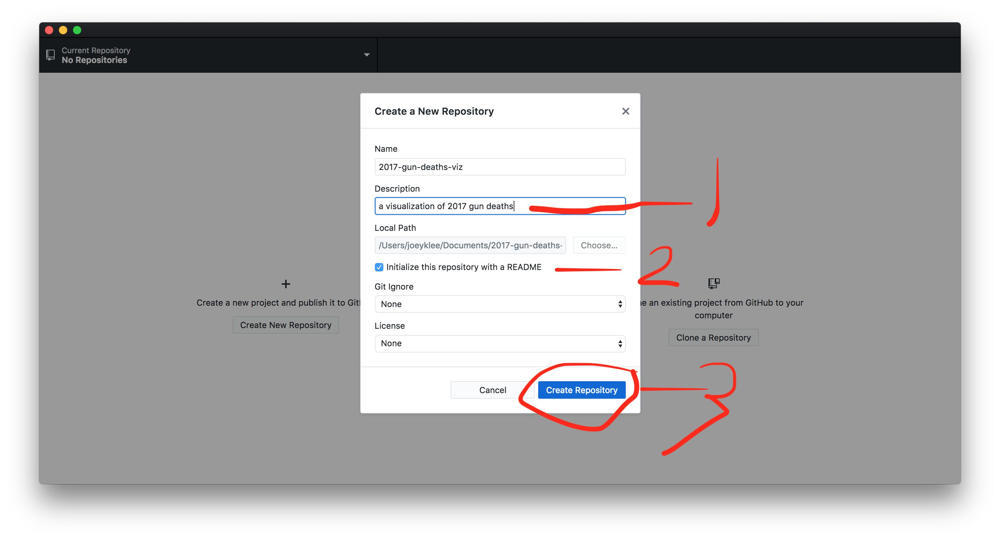

# Your first website with Github Pages (gh-pages)

## Step 1: Create an account with github

## Step 2: Create an empty repository called `{yourGithubUsername}.github.io`

## Step 3: Open Github Desktop tool & Sign In

Quite likely you'll need to sign in first: 
* (topleft) Github Desktop > preferences > 

## Step 4: Download your favorite P5.js sketch from your account on editor.p5js.org

## Step 5: Unzip the downloaded P5 project > rename the project to something reasonable > place that folder somewhere you normally work on projects

## Step 6: Examine your files! Open then in your text editor (e.g. Atom, Sublime, or VS Code)

## Step 7: Go to Github Desktop tool > add local repository > publish repository

## Step 8: Go to Github Website to see if anything popped up!

## Step 9: Create a `gh-pages` branch in the Github Desktop Tool > Publish Branch

## Step 10: Check if your page is working! go to {yourUsername}.github.io/{your-project-name}

In my case it is: joeyklee.github.io/2017-gun-deaths-viz

## Step 11: Go to Github and change your default branch to the gh-pages branch

This will make sure that as you're working on the `gh-pages` branch, this will be the main branch of code you and others see by default.

## Step 12: Make a change to your `index.html` file > check it out locally

## Step 13: Go to Github Desktop to find that your changes have been remarked! > Commit the changes > see your changes updated (it takes a minute or two to sync on the server) at {yourUsername}.github.io/{your-project-name}

<h1>Congratulations! You can now publish websites using github pages. The possibilities are endless for all the amazing you can start to make with this workflow. Bravo. I'm so proud of you! 🚀</h1>

