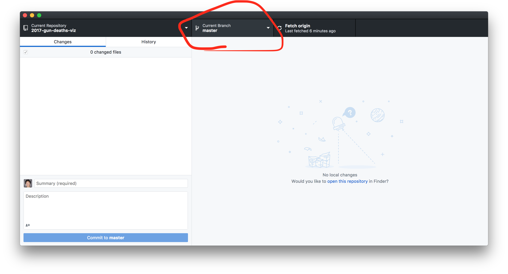

# Your first website with Github Pages (gh-pages)

### Why

The most important things about a project (aside from doing no harm) may possibly be: 1. Publishing and 2. Documentation. You may be the super duper mega designer or artist, but if you never publish your work, you'll never be able to affect change in the world. Furthermore, if you do a crummy job documenting your work, even if you were to publish your work, it may have less of an effect than if you had done a good job explaining your process, showing images, etc.

There are many ways to publish your work. Platforms abound that allow us space to communicate our ideas. These days we think of publishing as something that is web based, but certainly print media, video, sculpture, and other non digital media are healthy options. However, if you want to get your word out via the web, there are some options. 

Here's some platforms that come to mind that offer out-of-the-box soap boxes upon which we can stand - Twitter, Instagram, wordpress, tumblr, Medium. These options above have their caveats however: 

> What happens to the data you publish there? What's in a tweet? Where does it go? It is easy to get this stuff back? Do you control how your data is used by these services? 

They say nothing is free, and this is certainly true when you use these platforms. It is also important to acknowledge though that these platforms do offer a lot of opportunities for us to share with the world, but they do prescribe how you publish and what you publish. 

So why are we here? When you build your own custom website - e.g. when you make a p5.js sketch - you can run it locally on your computer as you make changes and updates or you can build it using the [P5 web editor](editor.p5js.org). If you've been using the [P5 web editor](editor.p5js.org), you know that it is possible to share your sketch with the world via that platform, but what happens if the [P5 web editor](editor.p5js.org) stops working? What happens if all of a sudden that service decides to shut down? Hopefully this will never happen, but if it were to happen, you'd lose all your content and all your hard work. Furthermore, platforms like the [P5 web editor](editor.p5js.org) offer the ability to build sketches, but they are not meant for hosting web pages, having custom domain names, and more - all elements of the web based projects that are important. 

There are certainly platforms across the web you can use to serve your content, but here's a few reasons why this tutorial is for you / why publishing your website with Github pages is for you:
+ 1. **hosting**: You're building a website (or a movement??) and you want a place to host it... for free ✨
+ 2. **openness**: It is important for you to show your documentation and process along with publishing your work - a Github repository becomes the place for your ~nonsenstive~ files.
+ 3. **fielding contributions**: You want people to or are open for people to contribute to your web project.
+ 4. **you don't require a server**: if you don't require a server, meaning you just are building a front-end web project, Github pages can serve up your static html, css, and javascript files. 

One day, Github may not be around, but the good thing is that you'll have all your files/projects locally on your computer so that when the next platforum pops up, you can use that thing. But for now, Github is still around for us. 

### Materials
- Computer: This tutorial was built using an Apple computer, so the images reflect this. You can also accomplish this in Windows as well. 
- Patience! This stuff takes time and can be 

<h1>Ready, Set, Go! 🚂</h1>

## Step 1: Create an account with github

## Step 2: Create an empty repository called `{yourGithubUsername}.github.io`

## Step 3: Open Github Desktop tool & Sign In

Quite likely you'll need to sign in first: 
* (topleft) Github Desktop > preferences > 

## Step 4: Download your favorite P5.js sketch from your account on editor.p5js.org

## Step 5: Unzip the downloaded P5 project > rename the project to something reasonable > place that folder somewhere you normally work on projects

## Step 6: Examine your files! Open then in your text editor (e.g. Atom, Sublime, or VS Code)

## Step 7: Go to Github Desktop tool > add local repository > publish repository

## Step 8: Go to Github Website to see if anything popped up!

## Step 9: Create a `gh-pages` branch in the Github Desktop Tool > Publish Branch

## Step 10: Check if your page is working! go to {yourUsername}.github.io/{your-project-name}

In my case it is: joeyklee.github.io/2017-gun-deaths-viz

## Step 11: Go to Github and change your default branch to the gh-pages branch

This will make sure that as you're working on the `gh-pages` branch, this will be the main branch of code you and others see by default.

## Step 12: Make a change to your `index.html` file > check it out locally

## Step 13: Go to Github Desktop to find that your changes have been remarked! > Commit the changes > see your changes updated (it takes a minute or two to sync on the server) at {yourUsername}.github.io/{your-project-name}

<h1>Congratulations! You can now publish websites using github pages. The possibilities are endless for all the amazing you can start to make with this workflow. Bravo. I'm so proud of you! 🚀</h1>

