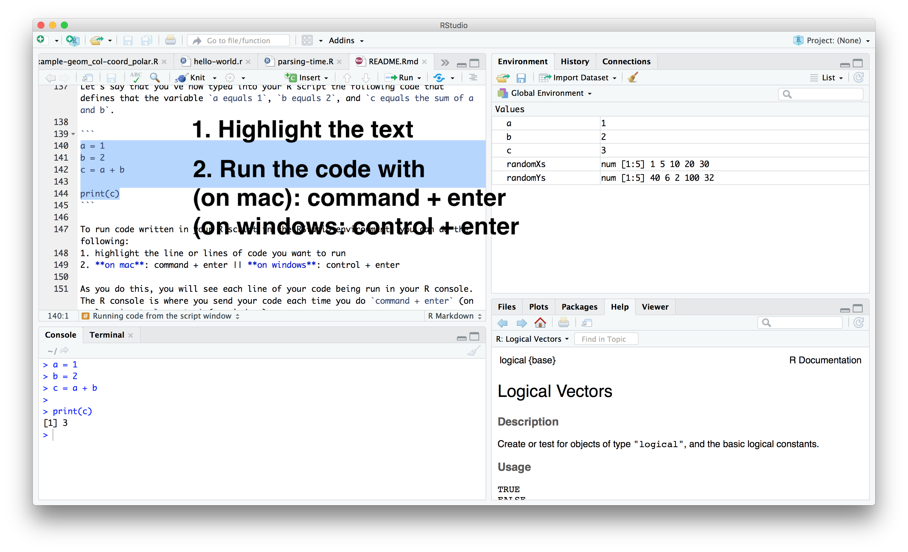
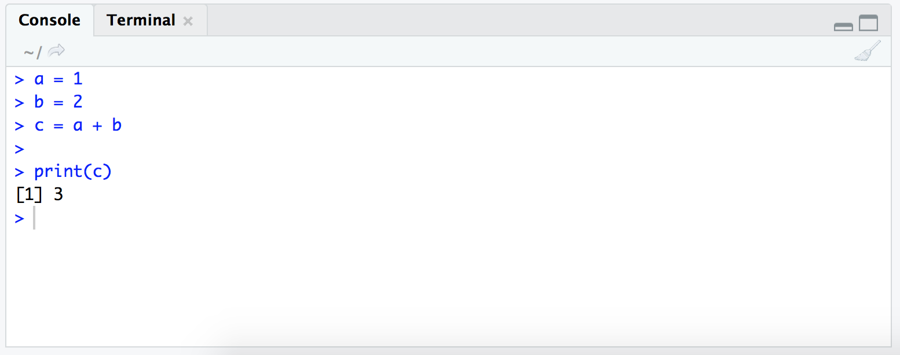

```{r setup, include=FALSE}
knitr::opts_chunk$set(echo = TRUE)
```


Behold! Follow along the steps below to learn the *ABCs* for the "R" programming environment.

## Setup

You will need to download and install:
* [R](https://cran.rstudio.com/)
* [RStudio](https://www.rstudio.com/products/rstudio/download/#download)


## Why are we learning R?

Programming languages are like materials, each with a distinct qualities, benefits, and limitations. In this way, it doesn't make sense to say one language is better or worse than another, rather that  they are just different. So why learn R? Here's why I chose to introduce R in this course:

* **High Level Programming Language**: R is what we consider a high level programming language. With a few lines of code, you can do *a lot* of stuff which is super nice when we're learning.
* **Easy to setup and has a nice Integrated Development Environment** (IDE): R is nice because it sort of lives within itself - it is easy to download, install, and setup, it is cross platform (it can be used in Windows, Mac OS, etc), and has a nice IDE called RStudio which we will use to help us write our code.
* **Large user community**: R has a HUGE user community that has grown to include domains of all sorts. This means also if you have a specific question that most likely someone has already found the answer and posted it online. The New York Times Data team is using R (among other things), for example! 
* **Super handy packages**: Because of the large user community people have developed packages for doing all sorts of cool things. Want to make an interactive map? Bam! There's an R package for that. Want to use color palettes from Wes Anderson's Movies? There's a package for that too! You'll start to see that packages will be your best friend, so use your favorite search engine and find the right packages for you!
* **Nice plots**: R is super handy for making quick plots - and this is a data visualization class after all. With one line of code you can already start looking at your data, add a few more and you already have something pretty to look at. As a way of exploring and displaying your data, R is a nice way to go. 
* **Local expertise**: Its always handy to have people around to help you if you get stuck. If you find yourself in a newsroom or aid agency or even a big tech company, it is quite likely that if there is data involved, then you might find R around. 
* **Open source/reproducible**: There are a lot of tools out there for doing data viz and data analysis these days, but it is important to keep in mind that one key advantage of working with open source software is that everyone can use and run your scripts. 

## R Studio IDE:

This is the R studio IDE. We will use R studio as our environment for running our code, making our scripts, and viewing our plots.R is an ***interpreted*** language meaning we can run our code line-by-line versus languages like Processing which are ***compiled*** which means they run all of the code at once. You'll see why this is advantageous for working with and exploring data. Anyways, because of this key difference, R studio is setup to help us explore our data line-by-line.


Your typical R studio IDE will look like the above and includes:

* **Script window**:A place to put your script (your entire code)
* **R console**: every line of code your run from your script will be run, evaluated and printed here. 
* **Global Environment**: This will show all the variables you declare and assign. The fancy thing about R studio is that it will tell you what kind of variable it is and even let your preview your data that you read in!
* **Plot, Packages, Help, & more**: Your plots will be shown here. Also you will be able to find packages and access R's help documentation.

## Focus Points:

+ **Print everything** - check that things are working and see how you change and manipulate data with functions and operations.
+ **Plot everything** - again, check that things are working and see how you change and manipulate data with functions and operations.
+ **Help your classmates and friends** - these will be the people you work with in the future - this is your network! The stronger you all are and closer you are, the better connections you'll have. 
+ (on the above point) the success of this workshop will be how the group collectively grows and learns so work together!  

## Syntactical Syntactics

### Mathematical Operators

| Operator   | Description | Example    |
| :--------: | :----------- | :---------- |
| `+`         | addition     | `1 + 2` // returns 3      |
| `-`         | subtraction  | `10 - 5` // returns 5     |
| `*`         | multiplication  | `3 * 2` // returns 6   |
| `/`         | division  |  `6 / 2`     // returns 3   |
| `^` or `**`	|		exponentiation | `3^2` or `3**2` // returns 9 |
| `%%`	|		modulus | `5%%2` // returns 1 |

### Logical Operators

| Operator   | Description | Example    |
| :--------: | :----------- | :---------- |
| `<`		|		less than | `3 < 2` // returns false  |
| `<=`	|			less than or equal to | `2 <= 3` // returns true  |
| `>`		|		greater than | `3 > 2` // returns true  |
| `>=`	|			greater than or equal to | `3 >= 2` // returns true   |
| `==`	|			exactly equal to | `6 == 6` // returns true  |
| `!=`	|			not equal to | `6 != 5` // returns true  |
| `!x`	|			Not x | `!x` // if x was FALSE this would return true  |
| `x | y`	|		x OR y | ` (x < 5)  |  (x > 10) ` // if x was 6 this would return false  |
| `x & y`	|		x AND y | ` (x > 5)  &  (x < 10) ` // if x was 6 this would return true  |
| `isTRUE(x)`|		test if X is TRUE | ` isTRUE(x) ` // if x was FALSE this would return false   |

## Running code directly from the R console


The R console works just like a calculator, except way more powerful because R keeps track of things like variables and R includes tons of functions that allow you to do complex analyses and make plots and more. 

Try running these directly in your R console:

**Addition**
```{r}

5 + 5
```

**Logical Operator Example**
```{r}

100 < 200
```


**String**
```{r}

"There is a light that never goes out"
```

**Simple Plot**
```{r}
randomXs = c(1, 5, 10, 20, 30)
randomYs = c(40, 6, 2, 100, 32)
plot(x = randomXs, y = randomYs )
```

## Running code from the script window

Rather than running everything from the R console, you'll more often be creating R scripts (files that end with .R) and running code line-by-line from the script window.


In this tutorial you can copy and paste and run all of the code that lives in between the code blocks like the one shown below, however whenever possible, I highly recommend typing it all out to get a feeling for the syntax and to comb through word by word: 

```{r}
# define a variable called greeting and assign it "hällo"
greeting = "hällo"
# use the print() function to log it in the console
print(greeting)

# define a variable called person and assign it "Joey"
person = "Joey"
# use the print() function to  log it in the console
print(person)

# use the paste() function to combine the greeting and person variables
# and use the print() function to log it in the console
print( paste(greeting, person, sep=" ") )
```

Let's say that you've now typed into your R script the following code that defines that the variable `a equals 1`, `b equals 2`, and `c equals the sum of a and b`. 

```
a = 1
b = 2
c = a + b

print(c)
```



To run code written in your R script in the RStudio environment, you can do the following:
1. highlight the line or lines of code you want to run
2. **on mac**: command + enter || **on windows**: control + enter

As you do this, you will see each line of your code being run in your R console. The R console is where you send your code each time you do `command + enter` (on mac) or `control + enter` (on windows).



Think of it like this
> your R script (.r) is the place where you write your R code (e.g. all your analyses and plotting functions) - it's just a bunch of text. Your console is where you send all that R code - all that text - to be interpreted by the computer to make all your analyses and plots come alive. 


*** 
***
***

# Handy Helpers

## Commenting your code

Now, to familiarize yourself with running code line-by-line from the script window, let's write another 3 statements, but this time **insert a comment** between each of the statements to neatly organize your code.

Comments are super duper mega important for keeping notes about the code you're writing. They are the critical pieces of info that are human readable that help you to remember what you did/what you're doing and so that others can read and understand what and why you did what you did.

**NOTE: In R, comments are made by using the hash symbol (#)**

Try writing 3 examples of your own in the script window and seeing what is printed to the console:

* **Commenting**:

```
# --- ABC's for R --- #
# remember anything after the comment symbol is not evaluated
```

**Multiplication**
```
# Multiplication
6 * 5
```

**Exponentation**
```
# Exponents
5**2
```
**String**
```
# Strings
"Hello World"
```

## Asking for Help: `?` or `help()`

You can "ask for help" by using the `?` operator combined with the function name. NOTE: This means you need to know which function you're asking about. 

For example try running the following:

Ask R about the "c()" function
```{r}
?c
```

Ask R about the "plot()" function
```{r}
?plot
```

You can also use the `help()` function which does the exact same thing

Ask R about the "c()" function
```{r}
help(c)
```

Ask R about the "plot()" function
```{r}
help(plot)
```

*** 
***
***

# Variables, Data, and Plotting

Before we take a leap into a real-world example, it's worth noting a few fundamental things about R variables, data, and plotting.

## R Variables
R is **losely typed** meaning that we don't need to specify the type of data that we are assigning to each variable - **notice we don't have to specify "int" or "float" or "String"** - R knows that type of data we are assigning!:

**I'm an integer variable:**

```{r}
a = 12
print(a)
```

**I'm a float variable**
```{r}
b = 16.5
print(b)
```

**I'm a string variable**
```{r}
c = "Hello"
print(c)
```


##  R datatypes
Here are a number of **fundamental R data types** that over time you will come to fully understand what they are, what makes them special, and when and where you would use them. For the 4 major data types below, all we need to now is that:

### Vectors (pretty much just a 1 dimensional Array):
A vector in R is basically a collection of elements of the **same** datatype (e.g numeric, character, boolean.) - a 1-D array. We create a vector in R by using the **c()** function. The **c()** is short for "concatenate" which means "paste together or chain together in a series" or "combine values into a list".

In the above examples we saw how we can assign single values to a variable. The power of programming really starts to show when you can assign a whole bunch of numbers to a variable.

Here's 2 examples of a vectors: 

```{r}
# Here's some data of months of the year and the precipitation in Vancouver
months = c(1, 2, 3, 4, 5, 6, 7, 8, 9 , 10, 11, 12)
precipitation = c(186, 94, 118, 85, 60, 59, 38, 39, 48, 126, 183, 177)
```

And the cool thing is you can plot these bad boys:

plot the monthly precipitation data as a scatterplot:

```{r}
# A simple scatterplot:
plot(x = months, y = precipitation)
```

Or how about a line plot:

```{r}
# a line plot:
plot(x = months, y = precipitation, type="l")
```

Or how about both lines and points:

```{r}
# scatterplot with lines - "b" stands for both:
plot(x = months,y = precipitation, type="b")
```

Or how about a barplot:	

```{r}
# plot it as a bar plot
barplot(height = precipitation, names.arg = months)
```

How easy and great is that? Sure sure, you're probably thinking "This is lame, I could do this in Excel" - but what if you had to make these graphs for every year in Vancouver since 1965? You could write a *loop* to automate that in R instead of clicking over and over again in Excel... AND if you needed to change a color or an axis label, you could just run your script again... just sayin'.

### Lists
An R list is a collection of elements (similar to a vector) BUT the key difference is that a list can contain different data types. Lists can be created by using the **list()** function and filling in values to be stored in the list. The key differene between vectors and lists is that **lists are not recursive**.

Here's an example of a list of all the same values:

```{r}
# Hey I'm a list:
my_list = list(3, 6, 9, 12,15)
```

Here's a list of lists of mixed data types:

```{r}
# ---- a list of lists ---- #
twitterLikes = list( 
Ellie = list(
        Handle = "@smellyEllie", 
        Posts = 134,
        Location = "London, UK",
        Description = "Maps are my lyfe"
        ),
Joey = list(
        Handle = "@leejoeyk", 
        Posts = 365,
        Location = "San Francisco, BC",
        Description = "Maps are my lyfe"
        ),
Sally = list(
        Handle = "@sallyseashore", 
        Posts = 15,
        Location = "Vancouver, BC",
        Description = "Loving Maps since day 1")
)
print(twitterLikes)
```

As you can see, depending on your data, this could be useful way of organizing and structuring your data. Looking kind of like Javascript Object Notation (JSON) with those keys and values, eh? 

### Dataframes

A dataframe is essentially data in a tabular form (think an excel spreadsheet) - it is composed of rows and columns of equal length. Each column is a vector ( aka 1-D array), meaning it contains all of the same data type (except for the header row) and is recursive, meaning that we can apply functions and mathematical operations on each column. Holy guacamole, does this mean R is really great at processing tabular data like excel sheets, csv files, and maybe even shapefiles? Yes! That is exactly right!

Very generally, dataframes are composed of vectors, which are like each column. OH! That means we can take our**month** and **precipitation** data and create a data frame?! yes! All we have to do is use the **data.frame()** function:

A dataframe of the rain data:

```{r}
# Here's some data of months of the year and the precipitation in Vancouver
months = c(1, 2, 3, 4, 5, 6, 7, 8, 9 , 10, 11, 12)
precipitation = c(186, 94, 118, 85, 60, 59, 38, 39, 48, 126, 183, 177)

# rain dataframe
rain_data = data.frame(months, precipitation)
print(rain_data)
```

This gives us a nice tabular dataset :)


We use R's selector operator ($) to select each column:

```{r}
# select the precpitation column and calculate the annual average
mean_precip = mean( rain_data$precipitation )
print(mean_precip)
```

And we see that the mean precipitation in Vancouver is **101.0833 mm**

Say, we wanted to plot the annual average on top of the monthly values, we could do something like this:

```{r}
# create the plot:
plot(x = rain_data$month, y = rain_data$precipitation, type = "b" )

# add the mean line:
abline(h= mean_precip)
```


**NOTE: We usually won't usually be making our own dataframes, but rather reading them in the form of delimited text files like .csv's .xls, .tsv, .dat, etc. **

### Matrices

Think of matrices as a raster or bitmap image. While the x and y dimensions can be different (e.g. like a photograph) all the columns must be the same data type.

```{r}
# runif(<how many random numbers you want>, <lower range>, <upper range> ) generates random numbers 
randomArrayOfNumbers = runif(1000, 0,1000)
# convert the list of numbers to a matrix, specifying the rows and columns
myRandomMatrix = matrix( randomArrayOfNumbers, nrow=40, ncol=25)
# plot it using the "image()" function
image(myRandomMatrix)
```

There are default datasets that come installed with R for testing. For example, let's look at R's `volacano` matrix dataset.

As a quick example, let's use one of R's preloaded datasets - a matrix (e.g. raster) of Auckland's Maunga Whau Volcano:

```{r}
# store the volcano data to a variable:
cano = volcano
head(cano)
```

Whoa! we get a bunch of print outs that essentially show this structure/numbers which represent the topography of this volcano:

Now let's plot it, but instead of using **plot()** let's use the **image()** function:

```{r}
# image() fuction to plot the cano
image(cano)
```
Wow! Such colors!


What other goodies can we plot? How about some contours?

```{r}
# contour lines of matrix
contour(cano)
```

And believe it or not, enter the 3rd dimension:

```{r}
# Get some perspective
persp(cano, expand = 0.3, phi=35, theta=10)
```


***
***
***

# Reading Dataframes from files:
We just saw how to *make* a dataframe using the **data.frame()** function using a set of **vectors**. Now let's *read in* data from a file as a *dataframe* using R's **read.csv()** function:

```{r}
# --- reading in data from a csv file --- #
# store the filename & path to a variable
fileName = 'https://raw.githubusercontent.com/joeyklee/aloha-r/master/data/rain2014.csv'

# pass the filename variable to the "read.csv()" function
# use "header=TRUE" if there's a header
rain_csv = read.csv(fileName, header=TRUE) 
```

If we look at the data again, we see that it looks exactly like the dataframe we created earlier

Now, we can do exactly the same steps as before **EXCEPT** we need to change the data name from **rain_data** to **rain_csv**:

```{r}
# select the precpitation column and calculate the annual average
mean_precip = mean( rain_csv$precipitation )
print(mean_precip)

# create the plot:
plot(x = rain_csv$month, y = rain_csv$precipitation, type = "b" )

# add the mean line:
abline(h= mean_precip)

```

NOTE: `read.csv()` will be the starting point for most of your projects. Essentially you always start with your data, reading it in, cleaning it up, and then embarking on your analysis and exploration.


***
***
***

# R Packages (aka libraries)
R packages (aka libraries) may be one of the most useful things about R. Libraries are basically bundled up scripts that people (software developers, researchers, designers, artists, etc) have written to help take complicated tasks or computations, wrapped up in simple(r) to use functions to make programming easier, more fun, and easy to read. 

In R, we have countless numbers of libraries to help us to tasks. Things like cleaning up data, making interactive web maps, and more. 


**NOTE: It may seem like R libraries are just doing magic behind the scenes, but they are simply making more functions available to you to use that aren't already included in the base R library - think of it as an actually library, you go there to get books that you don't have at home ;)** 

SO to start, we need to **install** the package we want to use. For the remainder of this course we will be using the `ggplot2` package as our plotting and graphics maker. It turns out that `ggplot2` is part of a suite of other handy tools included in the `tidyverse` https://ggplot2.tidyverse.org/ so we can get `ggplot2` bundled together when we install the `tidyverse` package.

## Installing packages

In order to install a package on your computer, you need to use the `install.packages()` function. What this will do is search the R universe for the package you are interested in, and download it to your machine.

Let's install `tidyverse` which will install `ggplot2` for us

```
install.packages("tidyverse")
```

## Using packages

Once you've downloaded a package, you will always need to `require()` it at the BEGINNING of your script. By using `require()`, you're telling R to bring all those handy functions into your project. 

**NOTE**: If you get an error like "cannot write to lib" or something on windows -- you **need to change the read/write permissions** on that folder. You can do so by navigating to that folder > right click > properties > check the box that says "read/write".

```{r}
# the very top of your script
require(ggplot2)
# there might be a bunch of other packages up here too

# ... then all the code you want to
```

Now that we have our package available for use, we can use all the functionality provided by that package. In this case we can start making our plots using `ggplot2`.


### geom_point
```{r}
# read in the ggplot2 library
require(ggplot2)

# using our rain_csv data
# create a ggplot() object which is our plotting area with our rain_csv data 
# then add geom_point or point geometries to that plotting area whereby months and precipitation are referencing the rain_csv data
ggplot(data=rain_csv) + geom_point( aes(x = months, y = precipitation ))

```

Now we have all the plotting power of ggplot2 at our hands. These points don't tell us much about the amount of precipitation, let's explore what other ways that ggplot2 allows us to easily show our data.

### geom_line

Now if we want to see the trend, we might try to use a line instead to go from month to month. Replace `geom_point` with `geom_line` and see what we get.

```{r}
ggplot(data=rain_csv) + geom_line( aes(x = months, y = precipitation ))
```

### geom_col

These lines give us a better idea of the trends in precipitation, but still, we might get a better idea if we use a bar chart. We can replace `geom_line` with the `geom_col` function to change the visualization once again

```{r}
ggplot(data=rain_csv) + geom_col( aes(x = months, y = precipitation ))
```

hey that's better!

### geom_col + geom_line

The great thing about using this "grammar of graphics" is that we can start layering visual encodings of data on top of our canvas easily. 

```{r}

ggplot(data=rain_csv) + geom_col( aes(x = months, y = precipitation )) + geom_line( aes(x = months, y = precipitation )) + geom_hline( aes(yintercept=mean(precipitation)) )
```

and if we want to take this a step further we can also add in another visual property to show the mean precipitation that year using the `geom_hline()` or "horizontal line"

```{r}
# use help(geom_hline) to see what you need to put in there
# the help tab can be confusing - even I don't understand it sometimes!
ggplot(data=rain_csv) + 
  geom_col( aes(x = months, y = precipitation), fill="aquamarine4") + 
  geom_line( aes(x = months, y = precipitation ), color="aquamarine1") + 
  geom_hline( aes( yintercept= mean(precipitation)), color="coral3" )
```

### coord_polar(): polar coordinate system

You can change the coordinate system of the visualization by adding the coordinate system of interest to your plot. Here we use the `coord_polar()` function to turn our bar chart into a radial diagram. 

NOTE: yes they look pretty, but it isn't so easy as read / you force your reader to do more mental exercise to make sense of your chart. However, there are times and places when such diagrams are useful.

```{r}
ggplot(data=rain_csv) + 
  geom_col( aes(x = months, y = precipitation )) +
  coord_polar()
```


***
***
***

# Mapping and Cartographics

Mapping gets its own intro section because there are a whole number of new considerations to make when working with geographic data. Cartography opens up the need to address issues around map projections (how we decide to warp our 3D ellipsoidal earth onto a 2D plane), privacy and masking of sensitive data (e.g. where people live), and spatial data formats which are different from non-spatial data formats (spatial data have geometries associated with a set of properties), and additional statistical considerations like spatial autocorrelation, the fact that in the US postal codes are synonymous with race, and more. 

We've seen vector and raster (matrix) data in the examples above. Mapping and cartographics require us to consider how those data relate spatially - their scale, (in)accuracies, etc. 

In these examples we are just going look at plotting our data. The rest we can explore further on in the course.

## geographic mapping with ggmap

Quick mapping onto image tiles from a web map tile service.

```{r}
# we will need the ggmap package which is part of the tidyverse
require(ggmap)
# we can store the result of get_map() in a variable called map_area
# get_map() takes a location, zoom, maptype, and source, and others as arguements
map_area = get_map(location = c(lon = -95.3632715, lat = 29.7632836), 
                   zoom = 10,
                   maptype="satellite",
                   source="google")

# we call ggmap() as our plotting area
# and add in our point lying at those coordinates
ggmap(map_area) + 
  geom_point(aes(x=-95.3632715, y=29.7632836), color="red", size=4 )
```


### geographic mapping using your own geographic geometries

Here we will look at how we can read geospatial data into R (in this case geojson) and plot it


First install and require() your necessary packages

```{r}
require("tidyverse")
require("sf")
```

Next read in and parse the nyc boroughs 
```{r}
# read_sf() is a function that allows us to PARSE geospatial data into a format we can use.
nycBoroughs = read_sf("https://raw.githubusercontent.com/dwillis/nyc-maps/master/boroughs.geojson")

# use the head() function ot see whats in the data columns
head(nycBoroughs)
```

Now we can use ggplot and the `geom_sf()` function to plot our data and use the "BoroName" as our fill color. 

```{r}
ggplot(data=nycBoroughs) + 
    geom_sf(aes(fill= BoroName)) 
```

Now imagine being able to combine our polygons (above) over a satellite image. Do you think you can handle it? I can hardly contain myself! 

```{r}
ny_map_area = get_map(location = c(lon=-73.979452, lat= 40.755870), 
                   zoom = "auto",
                   maptype="satellite",
                   source="google")

# we call ggmap() as our plotting area
# and add in our geometries lying at those coordinates
ggmap(ny_map_area) + 
  geom_sf( data=nycBoroughs, inherit.aes = FALSE, aes(fill=BoroName)) 

```

You can imagine now how you might create choropleth maps or dot density maps and more!

***
***
***

## Recap

From here, you have a foundation to start reading in data, making plots, and making your way around this new computational world.

We covered: 

* why we are using R
* the R studio interface
* basic math operators
* basic logical operators
* variables and data
* R's default plotting functions
* installing and requiring packages to enhance our abilities
* ggplot2 introduction 
* intro mapping abilities


***
***
***

# Statistical Functions

The power of programming in R really starts to shine when you combine it's handy functions for tidying data and exploring data with plots with it's statistical origins. In this course we will take a look at some of these handy statistical functions that will allow us to start looking deeper into data.

# Measures of Central Tendency

## mean

Calculating the mean is as simple as inputing your list and using the `mean()` function.

```{r}
mean(rain_csv$precipitation)
```

## median
Calculating the median is as simple as inputing your list and using the `median()` function.

```{r}

median(rain_csv$precipitation)
```


## mode

Calculating the `mode()` or most common number or feature in a list requires a little bit extra effort on our side. It also introduces an important but thus far not discussed topic of *defining our own functions*. Here, we define our own custom function called `calculateMode()` and use it to calculate the mode of this list of features.

NOTE: if there are only unique numbers, then the FIRST value will be returned!

```{r}
calculateMode = function( arr ){
  # via https://gist.github.com/jmarhee/8530768
  uniqueValues = unique(arr)
  # get the count of the values that are unqiue
  countValues = tabulate(match(arr, uniqueValues))
  # get the value which is most common
  mostCommonValue = uniqueValues[which.max(countValues)]
  return(mostCommonValue)
}

randomThings = c("badger", "badger", "badger", "snake", "snake", "badger", "mushroom", "mushroom")

calculateMode(randomThings)
```

## range

get the min and max values of the precipitation in the rain_csv

```{r}
range(rain_csv$precipitation)
```

## summary

The `summary()` function gives us the:
* min
* 1st quartile
* median
* mean
* 3rd quartile
* max

```{r}
summary(rain_csv)
```

## Standard Deviation

You can use `sd()` to calculate the standard deviation. Why is standard deviation interesting? It gives us a picture of the range of of variability there is for each value away from the mean.

```{r}
sd(rain_csv$precipitation)
```

## Z-score or Standard Score

A standard score or z-score is an indication of how far a raw score deviates from the mean, measured in the number of standard deviations. To calculate the z-score, we can do the following.

```{r}

meanPrecipitation = mean(rain_csv$precipitation)
sdPrecipitation = sd(rain_csv$precipitation)
# a z score for a given value is equal to the input value minus the mean divided by the standard deviation
zScoreForGivenValue = (72 - meanPrecipitation) / sdPrecipitation

print(zScoreForGivenValue)
```

So let's say that instead of get the standard score, we wanted to get the raw score from the z-score, we could alternative do:

```{r}
meanPrecipitation = mean(rain_csv$precipitation)
sdPrecipitation = sd(rain_csv$precipitation)
rawScore = (5 * sdPrecipitation ) + meanPrecipitation
print (rawScore)
```
this would tell us that if we were to be +5 deviations above the mean, we would have 383.1654 mm of precipitation relative to Vancovuer's average rain for 2014.

What's cool about this is that let's say we have a phenomenon that follows a normal distribution, then we could begin to calculate the relative incomes across countries for 0.5, 1, 2, and 3 standard deviations.


***
***
***

# A Bit of Data Wrangling and Parsing (week 3)

## Subset

## Aggregate/Group-by

## Pivot table

## Handling Time

## data joins


***
***
***

# Additional Resources:

* https://tutorials.iq.harvard.edu/R/Rgraphics/Rgraphics.html
* https://www.tidyverse.org/learn/
* R mapping: ggmap
  - http://eriqande.github.io/rep-res-web/lectures/making-maps-with-R.html
* lots of geodata here: https://github.com/dwillis/nyc-maps
* mapping tutorial: https://www.r-graph-gallery.com/327-chloropleth-map-from-geojson-with-ggplot2/

<!-- ```{r pressure, echo=FALSE} -->
<!-- plot(pressure) -->
<!-- ``` -->

<!-- Note that the `echo = FALSE` parameter was added to the code chunk to prevent printing of the R code that generated the plot. -->
