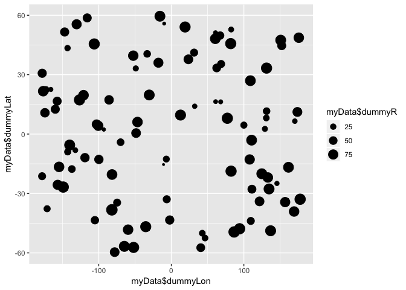
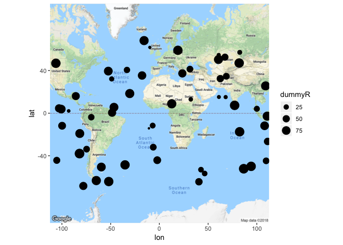

Random Data plots and R Markdown
================

Load up your packages!
----------------------

``` r
require(ggplot2)
```

    ## Loading required package: ggplot2

``` r
require(ggmap)
```

    ## Loading required package: ggmap

Make some dummy data!
---------------------

``` r
x <- runif(100, -179, 179)
y <- runif(100, -60, 60)
r <- runif(100, 10, 100)

myData <- data.frame(dummyLon=x, dummyLat=y, dummyR= r)
```

plot the initial data
---------------------

``` r
ggplot(myData) + 
  geom_point(aes(x=myData$dummyLon, y=myData$dummyLat, size=myData$dummyR))
```



Plot the random data on a map
-----------------------------

``` r
world <- get_map(location = c(lon = 0, lat = 0), zoom = 2)
```

    ## Map from URL : http://maps.googleapis.com/maps/api/staticmap?center=0,0&zoom=2&size=640x640&scale=2&maptype=terrain&language=en-EN&sensor=false

``` r
worldMap <- ggmap(world)

worldMap +
  geom_point(data=myData, aes(x=dummyLon, y=dummyLat, size=dummyR))
```

    ## Warning: Removed 43 rows containing missing values (geom_point).


