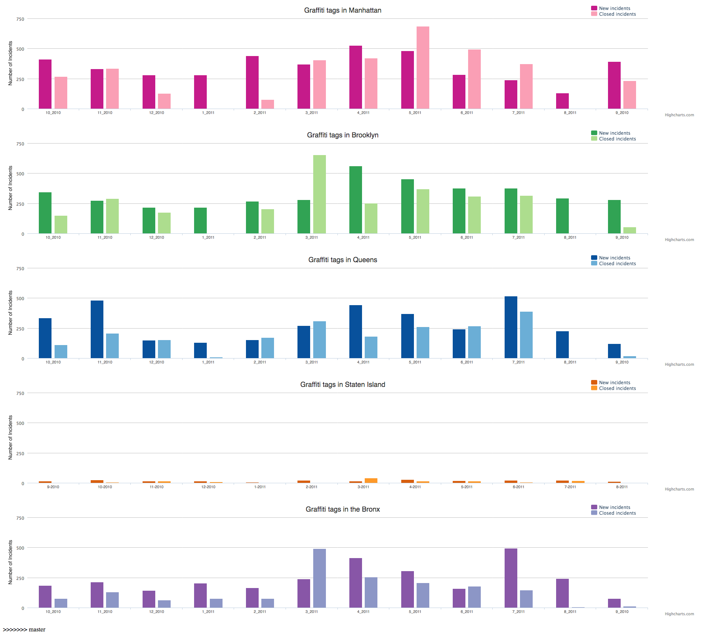

# Final Projects

- [Final Projects](#final-projects)
    - [Examples to inspire](#examples-to-inspire)
        - [Aurelia Moser, graphitiTime](#aurelia-moser-graphititime)
        - [Gun Deaths in America, 2017](#gun-deaths-in-america-2017)
        - [Jenna Xu, Speak Memory](#jenna-xu-speak-memory)
        - [Xiran Yang, My WeChat History With My Mother For A Year](#xiran-yang-my-wechat-history-with-my-mother-for-a-year)
        - [Miki Bin, Data Symphony](#miki-bin-data-symphony)
    - [Part 1: Proposals](#part-1-proposals)
        - [Requirements:](#requirements)
        - [Submission](#submission)
    - [Part 2: Mid Review](#part-2-mid-review)
        - [Requirements](#requirements)
        - [Submission](#submission-1)
    - [Part 3 - Week 14: Work-in-Progress Presentation](#part-3---week-14-work-in-progress-presentation)
        - [Submission](#submission-2)
    - [Part 4: Publishing / Submission](#part-4-publishing--submission)
        - [Submission](#submission-3)
    - [References](#references)
            - [ASSIGNMENT](#assignment)
            - [ASSIGNMENT](#assignment-1)

Alas, the moment you've all been waiting for - final project time! This will be a chance for you to:

1. reflect on the concepts you've learned in this class, 
2. challenge yourselves to apply some of these conceptual and practical methods we have learned, and 
3. work with some data that speaks to your research or interest more broadly.

Here's the final project schedule:

* *Week 10*: We are here now
* *Week 11*: Final Project pitch, critique, and feedback
* *Week 12*: Work on Final Projects | no class for 🦃 day
* *Week 13*: Work on Final Projects
* *Week 14*: Show work-in-progress | 🍕🍕🍕
* *Week 15*: Wrap up, submit, & publish | individual meetings
* *Final Projects DUE*: December 16th, 2018 @ 11:59 PM 

The plan is that each week in class during final project time, you will have most of the time to dedicate to working on your final projects. I will introduce handy tools and references for you to complete your projects and work with you and your groups individually with your specific goals. 

## Examples to inspire

### [Aurelia Moser, graphitiTime](https://github.com/auremoser/graphitiTime/)
* [Project Website](https://github.com/auremoser/graphitiTime/)
* [Github URL](http://aureliamoser.com/graphitiTime/)

### [Gun Deaths in America, 2017](https://editor.p5js.org/joeyklee/full/SkS7YRJ67)
* [Project Website](https://editor.p5js.org/joeyklee/sketches/SkS7YRJ67)
* [Github URL- TBD](#)

### [Jenna Xu, Speak Memory](http://xujenna.com/speakmemory/)
* [Project Website](http://xujenna.com/speakmemory/)
* [Github URL- not available](#)

### [Xiran Yang, My WeChat History With My Mother For A Year](https://xiranisabear.github.io/API-of-I/)
* [Project Website](http://xujenna.com/speakmemory/)
* [Github URL](https://github.com/xiranisabear/API-of-I)

### [Miki Bin, Data Symphony](https://mikibinxue.github.io/Data-Symphony/)
* [Project Website]https://mikibinxue.github.io/Data-Symphony/)
* [Github URL](https://github.com/mikibinxue/Data-Symphony/)

## Part 1: Proposals

https://github.com/joeyklee/quant-humanists-2018/blob/master/FINAL-PROJECT-REFERENCES.md

**About**: For your final projects, you will complete a visual exploration of data related to your thesis work and/or research interests. This exploration must be visual or otherwise tangible in some way that takes any form of data, whether images, text, or numbers and translates them a form that may be more accessible, comprehensible, or affective. 

It is important that you manage your ambitions by clearly defining your research question, focusing your design concept, and keeping your project scope tight. You final project will be evaluated on how clearly your concept is communicated through your chosen media and your thoughtfulness in considering all the things that you know as well as what you don't. Therefore it is important to take the time to read, write out, sketch, moodboard, and concept your final project proposal.

Your final project proposal is an opportunity for you to do the necessary initial research to clearly state the question you seek to address and the social phenomenon you're interested to comment on and your planned methods to communicate your idea. Be prepared to convince us about your concept and the methods with which you plan to make that concept tangible.

### Requirements:
* **Background research / Literature review**: clear indication that you've researched the current state of the art, literature, existing project landscape and/or similar works. Collect references and associated visuals.
* **Moodboard**: collection of images and references that point towards the style, feeling, or interactions you intend to develop through your project
* **Hypothesis / Definition of question(s)**: based on your research and experience define the question(s) you intend to approach / comment on through your final project.
* **Objectives**: describe tangible outcomes of your final project (e.g. create a hardware installation piece, develop an open API for XYZ)
* **Goals**: describe the higher level purpose of your intended project (e.g. create awareness about digital privacy issues, create hope for the future of AI in the world)
* **Sketches / Technical considerations**: sketches of the ways you intend to bring your goals to fruition.
* **Presentation of Proposal**: We will have a critique and feedback session next week, so please be ready to present your proposal in coherent and logical format (5 min for presentation).

Example of a final project proposals:
* [Chloe's project proposal](https://gist.github.com/chloemar10/811843f4e10207382c9550c710f78924)
    - [slides](https://docs.google.com/presentation/d/1GKxGs4u9_iF4VII_M5NDKbXBmsLe6Ab7Sp-itntyiKw/edit#slide=id.p)
* [Jenna's project proposal](http://www.xujenna.com/itp_blog/2018/03/26/qh-w7-hw-final-project-proposal-outline/)
    - [slides](xujenna.com/itp_blog/wp-content/uploads/2018/03/finalprojproposal.pdf)

### Submission

* Submit your proposal as a Github gist or as a blog post 
* NO LATE ASSIGNMENTS 

## Part 2: Mid Review

Short presentations to field feedback from classmates and Joey.

### Requirements

### Submission

* Submit the link to your presentation in a Github Gist or as a blog post
* NO LATE ASSIGNMENTS

## Part 3 - Week 14: Work-in-Progress Presentation

Presentation of your work-in-progress project - an evening of pizza + projects!

### Submission

* Prepare 10 minute project presentation outlining your progress and things you're looking for feedback on. In an ideal case, you will have a working prototype or beyond-proof-of-concept set of content that you can present on to the class. You will explain your project as a coherent narative that addresses your:
    - process,
    - results, and 
    - next steps, if any

Documentation e.g. screenshots, photos, and videos while you're working will be helpful material for showing your process.

* You will submit a link to your slides (PDF or google slides) as a Github gist or as a blog post.

## Part 4: Publishing / Submission

### Submission
* Wrap up meeting:
    - Meet with Joey individually to wrap up loose ends, discuss final project, and polish the project for submission.
    - ⏰ set appointment time 
* Publishing/Submission:
    - If you will be publishing your project publicly, you will publish your project as a:
        - Github Repo 
        - Github Pages hosted webpage
    - If you do not plan to publish your project publicly: let's discuss.

A complete submission will include the following:

* explain your process, sources, and reasoning in your README.md with the following sections:
* **Project Title**
* **Description**
* **Demo Link**
* **Project Procedure**: describe your data processing, visualization selection, and analysis post-visualization

## References

* Learn More:
    * [Bibliography](https://github.com/sva-dsi/2017-fall-course/blob/master/bibliography.md)
    * Defining development terminology: [Sideways Dictionary](https://sidewaysdictionary.com/)
    * Designing visual languages: [Tangram Tron](https://mapzen.com/blog/tron-v2-visual-scale/)
    * Designing visual vocabularies: [Style guide guide](http://bradfrost.github.io/style-guide-guide/)
    * Dealing with Data: [Missing Datasets](https://github.com/MimiOnuoha/missing-datasets)

* Konnikova, M., [_What Makes a Story Go Viral?_](http://www.newyorker.com/tech/elements/the-six-things-that-make-stories-go-viral-will-amaze-and-maybe-infuriate-you).
* Medium, [_What is Impactful? Or statistics at the service of stories_](https://medium.com/@Medium/statistics-2971adaa615).
* Reynolds, G. [_The secret of storytelling is in the editing_](http://www.presentationzen.com/presentationzen/2013/01/the-secret-to-success-is-in-the-editing.html).
* Schepers, A., [_Bordering on Factual: Fact Check Before Sharing_](http://schepers.cc/bordering-on-factual).
* [_WordSafety_](http://wordsafety.com/).

* Diakopoulos, N., [_Storytelling with data: what are the impacts on audience_](http://www.nickdiakopoulos.com/2013/04/12/storytelling-with-data-what-are-the-impacts-on-the-audience/).
* Hess, A., [_The Bro Whisperer of Bustle_](http://www.slate.com/articles/double_x/doublex/2014/08/bustle_one_year_later_bryan_goldberg_s_website_for_women_is_hugely_successful.single.html).
* Jefferson, C., [_The Racism Beat: What it's like to write about hate over and over again_](https://medium.com/matter/the-racism-beat-6ff47f76cbb6).

* Anderson, C., [_How to give a killer presentation_](https://hbr.org/2013/06/how-to-give-a-killer-presentation/ar/1).
* Rosling, H., [_TED talk salad_](http://www.ted.com/speakers/hans_rosling.html).

***
***
***

<!-- 

#### ASSIGNMENT
Think about the interactives we've seen this semester and plan out your template layout.

Reconsider your data and the pitch exercises from previous weeks, choose the best visualization and pitch for your narrative and pursue pushing that onto the web.

Here are some resources to help you get it on the web.

* [Github pages templates for sites](https://pages.github.com/)
* [Creating project pages on Github pages](https://help.github.com/articles/creating-project-pages-manually/)

Here is [an example of an interactive time series visualization](http://auremoser.github.io/graphitiTime/) of Graffiti cleanup rates (taken from 311 data). Here is [the code and readme](https://github.com/auremoser/graphitiTime/) explaining how this was made. This will be the format of your final projects, a small github pages site with graphics you designed, and a repo collecting all your materials (your sketches, links to your gists, your code and your resulting gh-pages site). All of your code will be submitted on github with at least a link to the live demo in the `README.md` of your repository.

#### ASSIGNMENT
Continue with working on your final projects, you can make something from [this template for example](https://auremoser.github.io/final-exam/).
 
* publish your project and code on Github
* post the interactive demo on `gh-pages` or use the Github pages setting in your repository settings
* explain your process, sources, and reasoning in your README.md with the following sections:

    * **Project Title**
    * **Description**
    * **Demo Link**
    * **Project Procedure**: describe your data processing, visualization selection, and analysis post-visualization
* prep your quick 3-min presentation (details below)

For next class, we will spend the first minutes of 12/7 going over your project pitches, please send me your current assignment/latest project draft **before** class, and prepare a 3 minute presentation of your project, describing why you chose it, what resulted from your efforts and what you would like to do with the project moving forward. This can be an informal overview of what you've worked on and struggled with to this point, low pressure, but still

 -->