# ASSIGNMENT 02: Dear Data - What do our mobility patterns tell us?
**DUE:** 20 September 2018, 6:00 PM


<!-- TOC START min:1 max:3 link:true update:true -->
- [ASSIGNMENT 02: Dear Data - What do our mobility patterns tell us?](#assignment-02-dear-data---what-do-our-mobility-patterns-tell-us)
  - [Brief](#brief)
    - [Collect](#collect)
    - [Parse](#parse)
    - [Filter and Mine](#filter-and-mine)
    - [Represent & Interact](#represent--interact)
    - [Refine](#refine)
  - [Deliverables](#deliverables)
  - [Submission](#submission)

<!-- TOC END -->

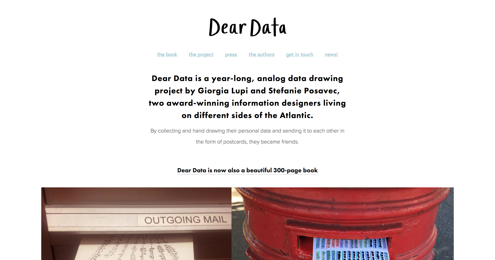

## Brief

This week we will begin dipping our toes into the data visualization workflow. This will involve:
  - defining a question(s)
  - determining variables that speak to the research question
  - selecting and defining a method for tracking, collecting, and/or acquiring the data we need
  - data collection
  - filtering, grouping, and processing your data to make sense of it
  - analyzing your data to pull out key insights and information worth communicating
  - experimenting with representation
  - defining the visual form which best speaks to the data/information we're interested in communicating
  - creating the visual for all the see
  - documenting our work to explain our visual
  - "defending" / explaining our process and visualization to our peers.

**Are you ready!? So exciting! Let's go!**

With the above process in mind, we will be following in the methodologies of the great [Stephanie Posavek](http://www.stefanieposavec.com/) and [Georgia Lupi](http://giorgialupi.com/) and building our own "Dear Data" hand drawn data visualizations. By this time next week, we will have 25 super curious and procedurely hand-generated visualizations of 1 week of our [mobility behavior](https://en.wikipedia.org/wiki/Travel_behavior) - when and by which transporation mode - do we take to get from A to B.

Knowing about your transportation behavior is handy for a number of reasons. Transportation and government agencies might use these data to increase the efficiency of their service and identify where they might better serve their audience. Know about your own travel behavior might show you how exciting (or regular) your life is, give you insights into your environmental impacts of your transport mode choices, and more.

To build our own travel/mobility survey, we will outline a process below: `Collect > Parse > Filter & Mine > Represent & Interact > Refine`

### Collect


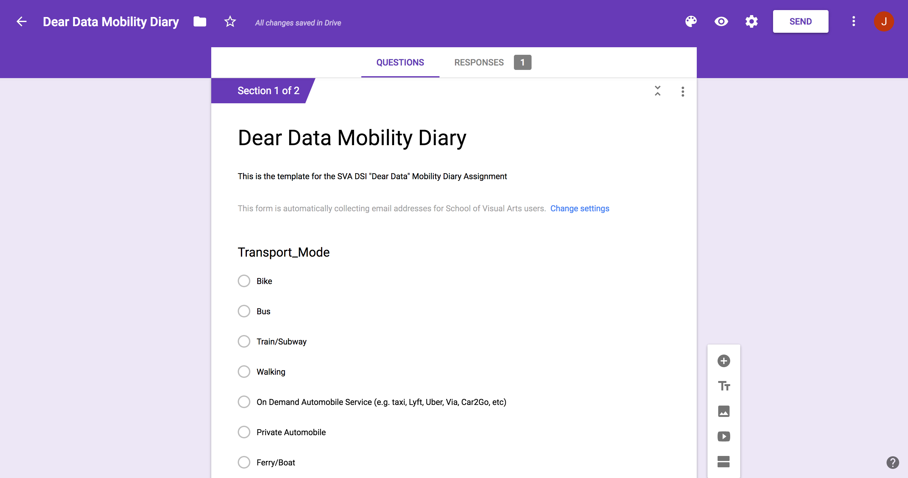

📼 **Follow along here**: https://youtu.be/BOn7t_7csYE

NOTE: for Transport_Mode (check boxes) - NOTE: not radio buttons, but checkboxes - allows you to select multiple modes of transport!

✅ **make a copy of the form for yourself**: https://drive.google.com/open?id=1_p3zcDPWvYwpwLjOwMZhCJdBWulLd_YWcEwFbJecYug 

Here's a video showing how you can:
1. create google form
2. add the relevant questions regarding our mobility behavior
3. add the form to the homescreen of your phone for easier access
4. look at your data in google spreadsheets
5. export that spreadsheet to a csv file.


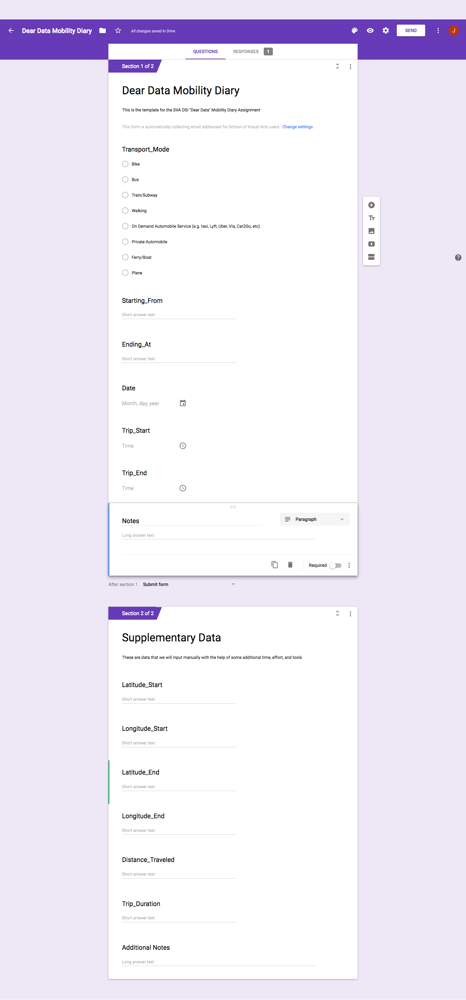

**Form questions**


Create a google form. In this google form you will create 2 sections. `Section 1: Primary Data` will include the data directly about your trip. `Section 2: Supplementary Data` will include the data that we will derive later on during our extended analysis.

* Section 1:
  - question: Transport_Mode (check box multiple choice) - NOTE: not radio buttons, but checkboxes - allows you to select multiple modes of transport!
    - Bike
    - Bus
    - Train/Subway
    - Walking
    - On Demand Automobile Service (e.g. taxi, Lyft, Uber, Via, Car2Go, etc)
    - Private Automobile
    - Ferry/Boat
    - Plane
    - Other (e.g. skateboard, roller skates, scooter, other non-motorized transport)
  - question: Starting_From (short answer)
    - e.g. "home"
  - question: Ending_At (short answer)
    - e.g. "SVA"
  - question: Date (data)
    - e.g. `MM/DD/YYYY`
  - question: Trip_Start (time)
    - e.g. `HH:MM AM/PM`
  - question: Trip_End (time)
    - e.g. `HH:MM AM/PM`
  - question: Notes (paragraph)
    - e.g. `going to work`
* Section 2: (these we will fill-in later on)
  - Latitude_Start (short answer)
    - e.g. `40.742417`
    - units: decimal degrees
  - Longitude_Start (short answer)
    - e.g. `-73.995713`
    - units: decimal degrees
  - Latitude_End (short answer)
    - e.g. `40.742417`
    - units: decimal degrees
  - Longitude_End (short answer)
    - e.g. `-73.995713`
    - units: decimal degrees
  - Distance_Traveled (short answer)
    - e.g. `12.6`
    - units: miles
  - Additional Notes (short answer)
    - e.g. `some supplementary notes`
  - Trip_Duration (short answer)
    - e.g. `106`
    - units: minutes


### Parse

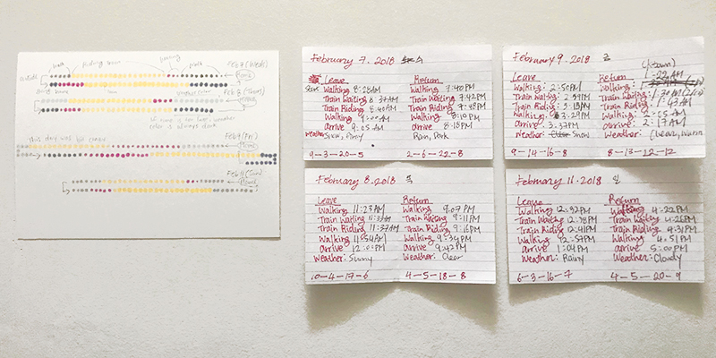

You can choose to work with your data by hand, in your favorite spreadsheet program (e.g. in Google Spreadsheets, Excel, Numbers, etc), or in R.

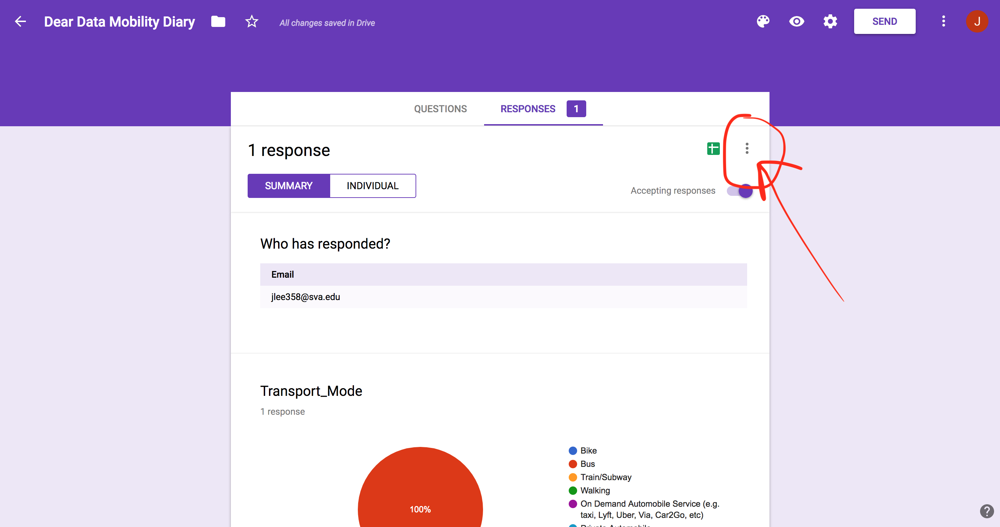
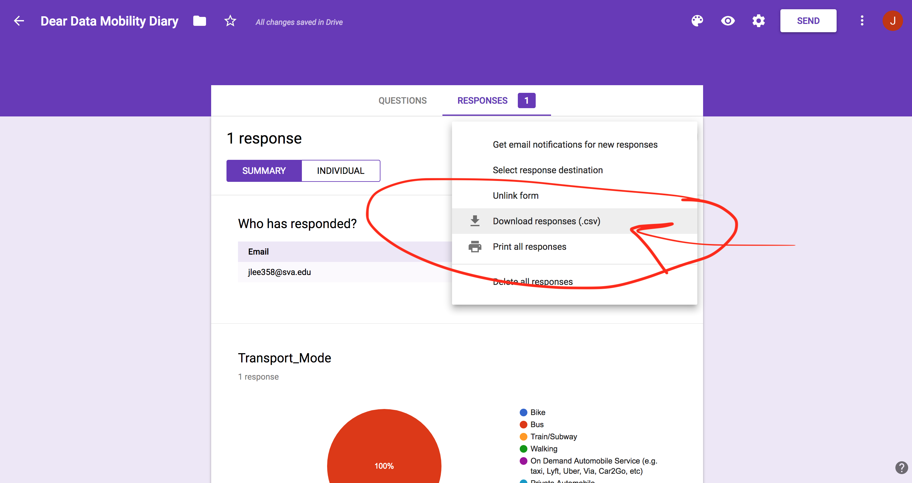

If you choose to export your data externally, you can export your data from your form responses by:

1. click your `responses` tab in your form
2. click on the 3 dots in the top right corner of your form
3. export to csv

#### Calculating Trip_Time

If you'd like to calculate the trip time in Google Spreadsheets, you can do so like so: https://youtu.be/kGkNxy86dw0

> view of opening up a csv in Numbers for Mac

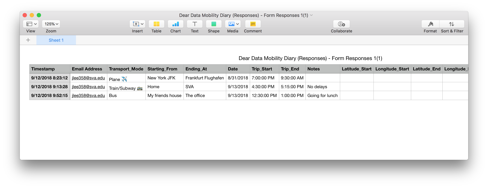

> view of opening up a csv in R

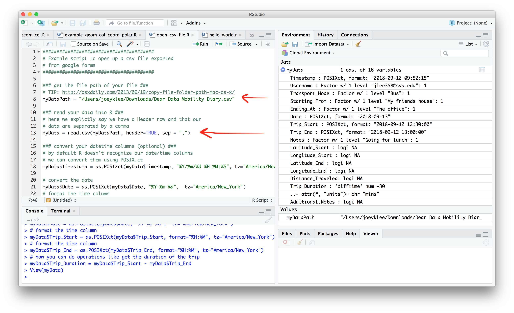
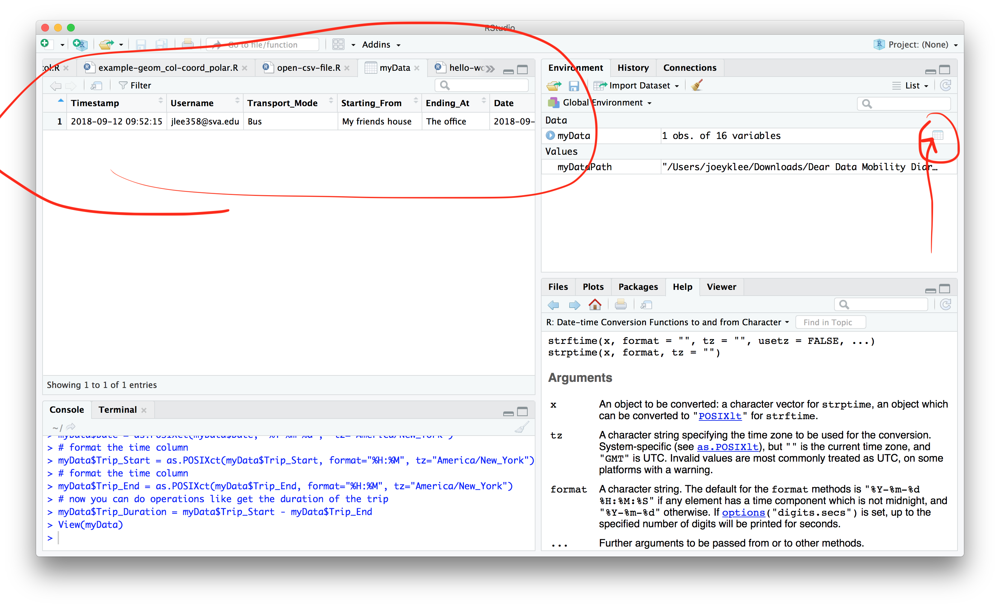

you can find the script for this little example here: [/examples/r-examples/basics/parsing-time.R](../examples/r-examples/basics/parsing-time.R)

```r

########################################
# Example script to open up a csv file exported
# from google forms
########################################

### get the file path of your file ###
# TIP: http://osxdaily.com/2013/06/19/copy-file-folder-path-mac-os-x/
myDataPath = "/Users/joeyklee/Downloads/Dear Data Mobility Diary.csv"

### read your data into R ###
# here we explictly say we have a Header row and that our
# data are separated by a comma
myData = read.csv(myDataPath, header=TRUE, sep = ",")

# and so on...
```

NOTE: Take notes about any issues you encounter in this step and how you've overcome them

### Filter and Mine

From here, it is up to you to decide what features you'd like to highlight, filter, and group. By looking around in your data, you might also start to find out certain insights that are unique to you and your knowledge of your behaviors. Note those down.

Do your data indicate you have a pretty regular transport behaviors? or do you mix it up this week? You should be able to start identifying some trends or a lackthereof.

NOTE: Take notes about the methods you are employing onto your data.

### Represent & Interact

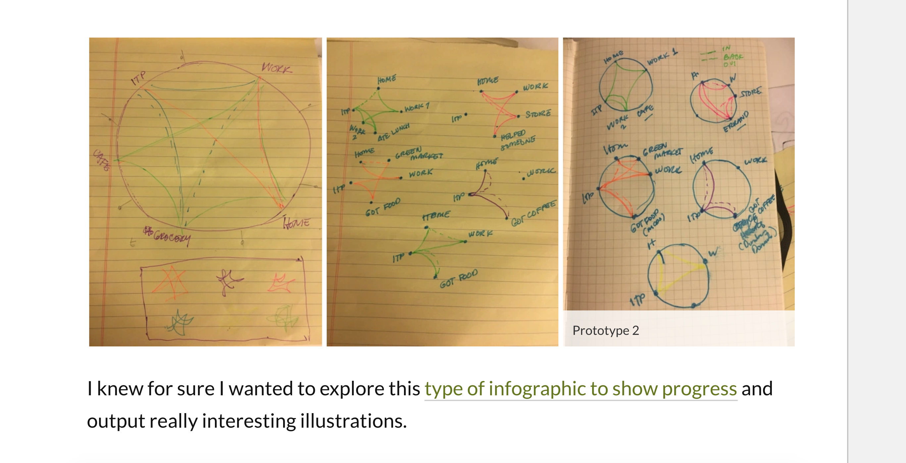
<small>via: https://kernfern.wordpress.com/2018/02/12/analog-tracking-my-daily-commute/</small>

With your notes in hand, begin playing with various visual forms - is it necessary to draw a map or is a bar chart ok? Do you go for something more expressive or literal?

Sketch out a few different visual expressions of your data to refine your understanding of what your data might be saying.

You may consider moodboarding based on what kinds of things you've found in your data.

NOTE: Take notes and photos of your sketches and visual experiments. Don't get caught up with perfection here, while you are perfect, your sketches do not need to be ;) !

### Refine

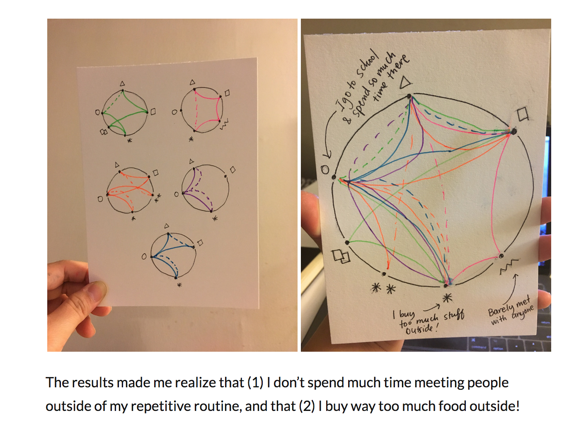
<small>via: https://kernfern.wordpress.com/2018/02/12/reflection-on-analog-tracking/</small>

You've sketched out a number of options, what has emerged? Is the aggregate of the week more interesting or do your day-to-days reveal something special?

Define the rules for your visualization - how are your data visually encoded by parameters such as length, area, direction, hue, saturation, etc?

Finally, draw your data illustration using your defined rules on your postcard!

Remember to include a legend on how to read your illustration.


If you wish to include an address, please put the SVA DSI address 😉

```
SVA DSI
136 W 21st St,
5th Fl.
New York, NY 10011
```

NOTE: Document your final outcome with photos.


## Deliverables

* [ ] Documentation of your process and notes submitted as a `gist` or on your blogs
* [ ] Documentation of your final outcome which includes the visualization and legend on how to read your visualization
* [ ] Bring your card to class next week to share and give feedback to your peers
* [ ] Bring your data so we can compile, anonymize and generalize sensitive location data if necessary

## Submission

* Submit the documentation outlined in the Deliverables section above to: https://github.com/sva-dsi/2018-fall-course/issues/6
* Bring your card to class
