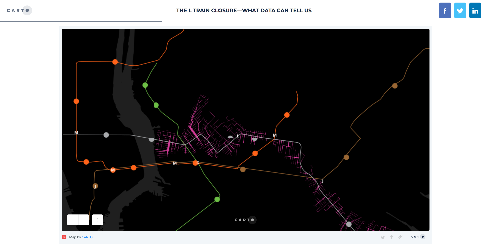

# WEEK `03`
## Data Compositions

<!-- TOC START min:1 max:3 link:true update:true -->
- [WEEK `03`](#week-03)
  - [Data Compositions](#data-compositions)
  - [ASSIGNMENT](#assignment)
  - [AGENDA](#agenda)
  - [PRACTICE](#practice)
  - [READINGS](#readings)
  - [ADDITIONAL RESOURCES](#additional-resources)
    - [Viz](#viz)
    - [Quant Self](#quant-self)
    - [On Data](#on-data)

<!-- TOC END -->

**Please make sure to log in your Attendance - thank you!**:
👉 [https://goo.gl/forms/17mjMPCWaMqC6p463](https://goo.gl/forms/17mjMPCWaMqC6p463)

## ASSIGNMENT

* [Link to Assignment 3](ASSIGNMENT03.md)

This week we will use the data we collected about our mobility behavior in our [week 2 assignment](../week02/ASSIGNMENT02.md) to tell the story of how we traveled last week. For more, go to the assignment brief above.

## AGENDA

<!--

- have a look at different data structures
- restructuring data
- csv, json, geographic data, timeseries, time

-->

**Project Highlight - Critique & Feedback**

* [The L Train closure—what data can tell us](https://carto.com/blog/looking-at-the-l/)

**DISCUSSION:**

* Make groups of 4-5, present eachother your Dear Data Assignment, shareouts as group
* Project Highlight: https://carto.com/blog/looking-at-the-l/
* Github:
  * grabbing latest from a fork
  * review - how many people went through the exercises?
  * questions & debugging
* Data Processing Exercise using collected Data
  * Collect data generated via google forms
  * calculate distances traveled
  * calculate trip duration
  * apply "simple" co2 emissions calculation based on mode of transport and distance
  * plot results in a way that tells the story.
  * share as markdown file.

<!--
* Data Compositions:
  * A look into common data structures and how to work with them
  * Specific emphasis on common formats:
    * csv
    * json
    * geographic data:
      * .shp
      * geojson
      * geotiffs and raster data?
  * How to handle specific properties:
    * time & timeseries

-->

**STUDIO:**
* Data Processing Exercise using collected Data

## PRACTICE
* [The Complete ggplo2 tutorial](http://r-statistics.co/Complete-Ggplot2-Tutorial-Part1-With-R-Code.html)
* [ggplot2 Mastering the Basics](http://www.rebeccabarter.com/blog/2017-11-17-ggplot2_tutorial/)
* Incredible set of resources from Jenny Bryan at UBC - total stats guru:
  * https://github.com/jennybc/ggplot2-tutorial#ggplot2-tutorial
  * https://github.com/jennybc/ggplot2-tutorial/blob/master/gapminder-ggplot2-scatterplot.md

## READINGS
* Truthful Art, Alberto Cairo, Chapter 3 - pg. 69 - 99

## ADDITIONAL RESOURCES

### Viz
* [Untangling Tennis - OpenViz Conf](https://www.youtube.com/watch?time_continue=1&v=Ufjm_LD_d0o)
* [Data Sketches with Shirley Wu and Nadieh Brehmer](https://www.youtube.com/watch?v=4EOG7KwFspk)

### Quant Self
* Rose, Brett., [No,No, Phones Aren't More Accurate Than Fitness Wearables](https://www.wired.com/2015/03/fitness-tracking-test/)
* Eveleth, Rose., [Your Vagina is Not a Machine](http://www.refinery29.com/kgoal-loop-kegels-trackers) + [How self-tracking apps exclude women](https://www.theatlantic.com/technology/archive/2014/12/how-self-tracking-apps-exclude-women/383673/)
* Quantified Self, [Make Your Own Mobile Self Tracker with Google Docs](http://quantifiedself.com/2009/05/diy-mobile-self-tracker/)
* [MacDonald, Kyle., Sleep](https://medium.com/@kcimc/sleep-and-fatigue-328b05f854a8)

### On Data
* Lowe, Scott., [What is JSON](https://blog.scottlowe.org/2013/11/08/a-non-programmers-introduction-to-json/)
* MacWright, Tom, [More than you'd ever want to know about geojson](https://macwright.org/2015/03/23/geojson-second-bite)
