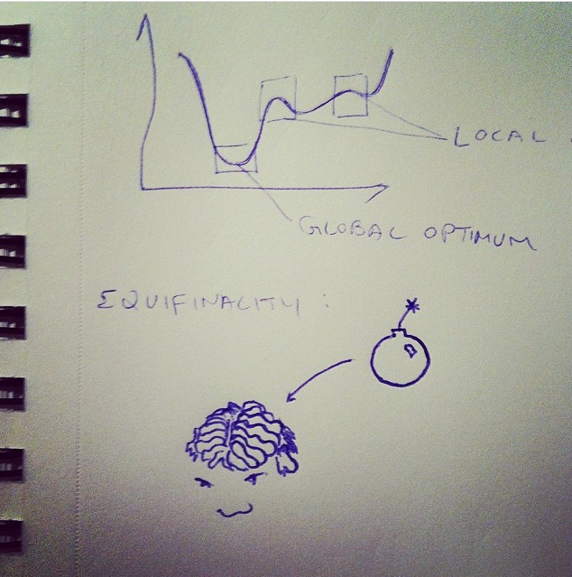

# WEEK `04`
## Introduction to Computational Media

**Please make sure to log in your Attendance - thank you!**:
👉 [Link to google form](https://goo.gl/forms/QM1ptZoG7LDvLnq33)

## ASSIGNMENT

* [Link to Assignment 4](ASSIGNMENT04.md)

## AGENDA

**DISCUSSION:**

* Quick motivational speech: [The gap by Ira Glass](https://vimeo.com/85040589)
* Re-Roadmapping for the course
* Throwbacks
  * 
  * I remember my first class programming in grad school. It felt like this.
* Insight from assignments:
  * people really grasped the data viz process - cool to see people framing their blog posts around that.
  * ...
  * ...
- how are data and computation related? & why should we care about computation?
* We live in a computational and data driven world
  * [James Bridle, ]()
* Data visualizations provide opportunites to see systems, others, and ourselves. For example:
  * Trevor Paglen, [Surveying Surveillance](https://www.independent.co.uk/news/world/americas/secret-state-trevor-paglen-documents-the-hidden-world-of-governmental-surveillance-from-drone-bases-9536376.html) | Photography
  * [Anna Wiederkehr — Fine. Designing and visualising emotions](https://vimeo.com/244517309)
  * Josh Begley, [Prison Map](http://prisonmap.com/) | Photography, Mapping
  * Gelare Koshgozaran, [Why | 2010](https://gelarekhoshgozaran.com/VISUAL/WHY-2010) | Video, screen recording
  * [Clio Andris, David Lee, Marcus J. Hamilton, Mauro Martino, Christian E. Gunning, John Armistead Selden, in PLOS ONE](https://www.washingtonpost.com/news/wonk/wp/2015/04/23/a-stunning-visualization-of-our-divided-congress/?noredirect=on&utm_term=.4b1958f6d111)
  * Periscopic, [US Gun Deaths](https://guns.periscopic.com/?year=2013) | Animation, interactive web
  * Propublica, [Losing Ground](https://projects.propublica.org/louisiana/) | Interactive web
  * Pudding.cool, [The road to gender parity in the House of Representatives](https://pudding.cool/2018/07/women-in-congress/)
  * Amy Cesal, Day Doh Viz [Daily visualizations with play doh](https://www.amycesal.com/day-doh-viz-all/)
  * Nicholas Felton, [2014 Annual Feltron Report](http://feltron.com/FAR14.html)
  * Viegas & Wattenberg, [Wind Map](http://hint.fm/wind/)
  * Jenny O'Dell, [All the People on Google Earth](http://www.jennyodell.com/allthepeople.html)
* Why computation and why P5.js?
  * It's a great learning tool
  * Great community with lots of examples - #CodingTrain #Shiffman
  * Opens up new possibilities for interacting on the web, across devices, and even hardware.
  * Establishes a strong foundation for building more complex applications, visuals, and interactions across use cases and domains.
  * Gives us a language to speak to others & collaborate across domains
  * I ❤️ p5.js and I think you will too!

**Project Highlight - Critique & Feedback**
* Trevor Paglen, [Surveying Surveillance](https://www.independent.co.uk/news/world/americas/secret-state-trevor-paglen-documents-the-hidden-world-of-governmental-surveillance-from-drone-bases-9536376.html) | Photography

**STUDIO:**

Let's review what we've learned through the assigned videos:

* In the [Week 3 Assignment (Updated)](../week03/ASSIGNMENT03-UPDATED.md) we learned about:
  * **P5.js**, it's origins, and why it is interesting for us as artist, designers, and makers of things
  * **The P5 web editor** - an online code editor that allows us to write and interact with our programs in the browser
  * **Shapes and Drawing** with P5.js and the very basic syntax for adding shapes and visuals to a drawing canvas as well as how to read documentation on how to discover new shapes.
  * **Color** in P5.js and how to change the stroke and fill of our different canvas elements like our rectangles, circles, and lines
  * **Errors** and how to read, understand, and debug programs if your computer doesn't understand your commands.
  * **Code comments** and how to make sure we can write out clear notes about how things work in our programs.
  * The **setup()** and **draw()** functions and how the p5.js structure allows us to create animations
  * **Variables** like `mouseX` and `mouseY` and also self-defined variables that allow us to better control our programs
* This means we should at this point we can effectively:
  * use code to draw shapes to the screen, change the colors of those shapes, and begin to **parameterize** our sketches using variables.

####  Here's a list of our current p5.js vocabulary:

* we will add a few new shape functions to our repertoire:
  * point();
  * line();
  * ellipse();
  * rect();
  * quad();
  * triangle();
  * arc();
  * bezier();
  * image();
  * for examples see, under `###_shapes`: https://editor.p5js.org/joeyklee/sketches
* We have some functions that allow us to affect our geometries:
  * fill(), noFill();
  * stroke(), noStroke();
  * strokeWeight();
* We will use variables built in to P5.js like:
  * mouseX, mouseY
  * width, height
  * mouseIsPressed
* And we will create our own variables to store values
  * and we should begin to think about variable scope - where variables need to be defined so they can be made available across your program == global scope vs. local scope variables.
* And we have some structural features of p5:
  * setup();
  * draw();
  * `preload(){}`
  * `mousePressed()`

<!--

- Week 4: **introduction to computation**
  - how are data and computation related?
  - why should we care about computation?
  - how are data being visualized?
  - intro to p5 and coding visuals
  - **Studio**:
    - Downloading p5 projects from p5 editor and working locally
    - review of variables and parameterization
      - variable scope: global and function level
    - introducing your own custom functions:
      - functions that do stuff
      - functions that return data
  - **Assignment**:
    - Coded Composition I
    - Watch videos: objects, map(), random() conditionals, iteration

-->

## Examples:

- [009_shapes-bezier-2-mouse](https://editor.p5js.org/joeyklee/sketches/HkGY2RtYQ)
- [009_shapes-bezier-2-styled](https://editor.p5js.org/joeyklee/sketches/SkaIh0Yt7)
- [009_shapes-bezier-2](https://editor.p5js.org/joeyklee/sketches/S14n_CYFX)
- [009_shapes-bezier](https://editor.p5js.org/joeyklee/sketches/SJaSDRFKQ)
- [008_image-loop-grid](https://editor.p5js.org/joeyklee/sketches/SkjS8AFYX)
- [008_image-loop](https://editor.p5js.org/joeyklee/sketches/B1o18AtFQ)
- [008_image-sizing](https://editor.p5js.org/joeyklee/sketches/SJDrS0Yt7)
- [008_image](https://editor.p5js.org/joeyklee/sketches/HJ357RKFX)
- [007_shapes-triangle-group-parameterized copy](https://editor.p5js.org/joeyklee/sketches/rJCAM0tYQ)
- [007_shapes-triangle-group-parameterized](https://editor.p5js.org/joeyklee/sketches/BJllfAFYX)
- [007_shapes-triangle-group](https://editor.p5js.org/joeyklee/sketches/HJ9tbCtFm)
- [007_shapes-triangle](https://editor.p5js.org/joeyklee/sketches/r1dNbRFKm)
- [006_shapes-quad-simple](https://editor.p5js.org/joeyklee/sketches/SyWOeRKYm)
- [006_shapes-quad-mouse](https://editor.p5js.org/joeyklee/sketches/SkpA0ptt7)
- [006_shapes-quad](https://editor.p5js.org/joeyklee/sketches/rk8iapKKm)
- [005_shapes-arc-mouse-modes](https://editor.p5js.org/joeyklee/sketches/r1LAnatKm)
- [005_shapes-arc-mouse](https://editor.p5js.org/joeyklee/sketches/HktLnTKtQ)
- [005_shapes-arc](https://editor.p5js.org/joeyklee/sketches/ByUVnpKt7)
- [004_shapes-rect-loop](https://editor.p5js.org/joeyklee/sketches/BkOiFTFtm)
- [004_shapes-rect-rectMode-parameterized-mouse-map](https://editor.p5js.org/joeyklee/sketches/SJtSKaFtQ)
- [004_shapes-rect-rectMode-parameterized-mouse](https://editor.p5js.org/joeyklee/sketches/H1jmtptK7)
- [004_shapes-rect-rectMode-parameterized](https://editor.p5js.org/joeyklee/sketches/BJN1YptYQ)
- [003_shapes-rect-rectMode](https://editor.p5js.org/joeyklee/sketches/H1AiratK7)
- [003_shapes-rect](https://editor.p5js.org/joeyklee/sketches/B1YKBattQ)
- [002_shapes-ellipse-group-parameterized-mouse-map-loop](https://editor.p5js.org/joeyklee/sketches/BJsjNpKFX)
- [002_shapes-ellipse-group-parameterized-mouse-map](https://editor.p5js.org/joeyklee/sketches/ryrw46KYX)
- [002_shapes-ellipse-group-parameterized-mouse](https://editor.p5js.org/joeyklee/sketches/Syxp7aKFm)
- [002_shapes-ellipse-group-parameterized](https://editor.p5js.org/joeyklee/sketches/SkpLQpYYQ)
- [002_shapes-ellipse-group](https://editor.p5js.org/joeyklee/sketches/HyMG76tF7)
- [002_shapes-ellipse](https://editor.p5js.org/joeyklee/sketches/HJn0zTFY7)
- [001_shapes-line-group-bigger-parameterized-loop](https://editor.p5js.org/joeyklee/sketches/SJ5VVhttm)
- [001_shapes-line-group-bigger-parameterized-mouse-map](https://editor.p5js.org/joeyklee/sketches/HkPm72Kt7)
- [001_shapes-line-group-bigger-parameterized-mouse](https://editor.p5js.org/joeyklee/sketches/BJcemnKtQ)
- [001_shapes-line-group-bigger-parameterized](https://editor.p5js.org/joeyklee/sketches/S1soG3KFm)
- [001_shapes-line-group-bigger](https://editor.p5js.org/joeyklee/sketches/BJiQMnKKX)
- [001_shapes-line-group](https://editor.p5js.org/joeyklee/sketches/ryLnZhtYm)
- [001_shapes-line](https://editor.p5js.org/joeyklee/sketches/B1xIW3YYQ)
- [000_shapes-point-group-variablized-mouse-mapped ](https://editor.p5js.org/joeyklee/sketches/ByDk-nFt7)
- [000_shapes-point-group-variablized-mouse](https://editor.p5js.org/joeyklee/sketches/Syoil3ttm)
- [000_shapes-point-group-variablized](https://editor.p5js.org/joeyklee/sketches/BJ1ugnYKm)
- [000_shapes-point-group](https://editor.p5js.org/joeyklee/sketches/S1VO1hFYX)
- [000_shapes-point-bigger](https://editor.p5js.org/joeyklee/sketches/HyDH13FYQ)
- [000_shapes-point](https://editor.p5js.org/joeyklee/sketches/rksl1nYt7)
- [011_aloha-synthesis-1](https://editor.p5js.org/joeyklee/sketches/Sk962V_FX)
- [009_aloha-nestedLoop](https://editor.p5js.org/joeyklee/sketches/ryjM2NOFQ)
- [007_aloha-forLoop](https://editor.p5js.org/joeyklee/sketches/H1_CiVuYX)
- [006_aloha-eraser](https://editor.p5js.org/joeyklee/sketches/rJGBsVuYm)
- [005_aloha-80sShapes](https://editor.p5js.org/joeyklee/sketches/H1Dzs4ut7)
- [004_aloha-funnyFish](https://editor.p5js.org/joeyklee/sketches/HyKicEdtX)
- [003_aloha-strokeWeight](https://editor.p5js.org/joeyklee/sketches/Bk-P94utm)
- [002_aloha-dynamic-mouse-speed](https://editor.p5js.org/joeyklee/sketches/rkb6t4uFX)
- [001_aloha-dynamic-sketch](https://editor.p5js.org/joeyklee/sketches/HJKDYVuFX)
- [000_aloha-static-sketch](https://editor.p5js.org/joeyklee/sketches/B1U-FN_YX)

## PRACTICE

> imitation is the sincerest form of flattery

Today we will reinforce what we've learned so far and extend our skills by coding one of the following drawings of your choice and remixing it by parameterizing aspects of the forms with variables and user interactions. See [ASSIGNMENT04.md](ASSIGNMENT04.md) for details.

|     |     |     |
| --- | --- | --- |
|     |     |     |

## READINGS
* Truthful Art, Alberto Cairo, Chapter 4: Of Conjectures & Uncertainty - pg. 99 - 116
* Georgia Lupi, [Sketching with Data Opens the Mind’s Eye](https://medium.com/accurat-studio/sketching-with-data-opens-the-mind-s-eye-92d78554565)

## ADDITIONAL RESOURCES

* James Bridle [The nightmare videos of childrens' YouTube — and what's wrong with the internet today | James Bridle](https://www.youtube.com/watch?v=v9EKV2nSU8w) | The ways that data and automation produce other kinds of visualizations - children's content - in ways that are disturbing and harmful, and reinforce problematic histories and social systems.
  * [Somethig is wrong with the internet, Medium](https://medium.com/@jamesbridle/something-is-wrong-on-the-internet-c39c471271d2)

* This is a workshop I made for the Processing environment. Almost everything should work EXCEPT the sections on "Data" will be different and instead of `void setup() and void draw()` we have `function setup() and function draw()` among other differences: https://github.com/joeyklee/aloha-processing ==> I've ported some of hte examples over to my p5 web editor account, see sketches with `aloha` in the name:
  - https://editor.p5js.org/joeyklee/sketches
