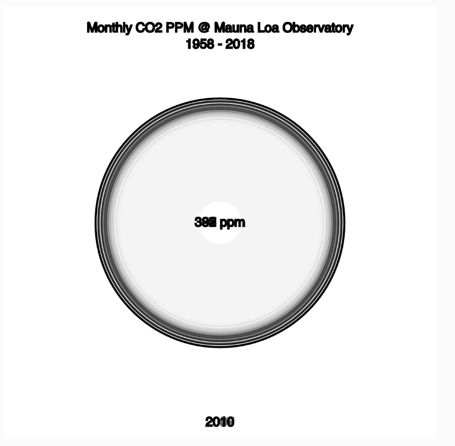
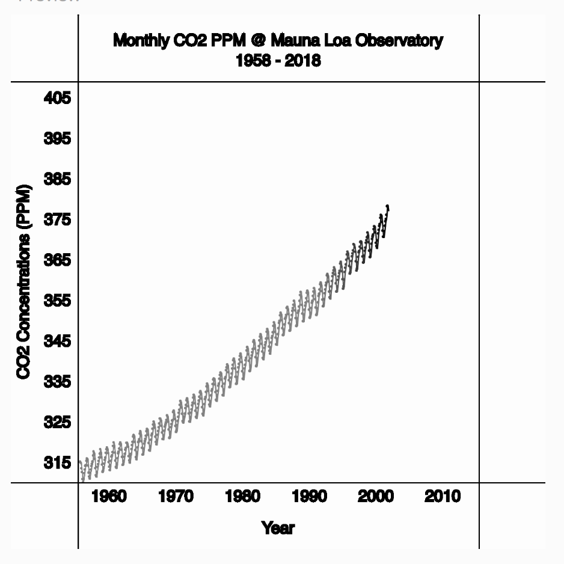

# ASSIGNMENT 05: Global CO2 Rise
**DUE:** 11 October 2018, 6:00 PM

## Brief

The [Mauna Loa Observatory in Hawaii](https://www.esrl.noaa.gov/gmd/obop/mlo/) has been taking measurements of CO2 concentrations since 1958. As per the National Oceanic and Atmospheric Administration (NOAA) website, "The undisturbed air, remote location, and minimal influences of vegetation and human activity at MLO are ideal for monitoring constituents in the atmosphere that can cause climate change." The data from Mauna Loa has thus been central to our understanding of the rising global background for CO2 concentrations in the atmosphere in our recent history.

Your task will be to create a visualization that visualizes the rise in global CO2 concentrations over the last 80 years. Using the measured CO2 concentrations data measured at the Moana Loa Field Station in Hawaii, you will use your newly acquired knowledge to show how CO2 concentrations have changed over time.

When we think about showing data over time, our minds quite likely think about a timeseries chart, which shows time on the X axis and the variable of interest on the Y axis. In the case of our CO2 data, we can see the example above - the Keeling Plot, named after Charles David Keeling (https://en.wikipedia.org/wiki/Keeling_Curve) - shows the steep increase in CO2 over the last 80 years, plus the seasonal variability.

In this assignment, our goal is to use our skills to show the data changing dynamically over time. We will:

- `parse` data in p5.js (`loadTable()`), bringing in a `.csv` file which includes monthly data of CO2 from 1958 - 2018
- `filter` data by removing values that are unrealistic or specifically showing null values (-99.99) using `for loops` and `if/else` statements
- `use variables and objects` to store our data in our program so it is easy for us to visualize
- `animate our data` as it changes over time.

Some inspiration: https://scripps.ucsd.edu/programs/keelingcurve/

### Option 1: Animated Area

### Option 2: Animated Keeling Curve

NOTE: this option is a bit more challenging, but you got this!

## Data

See: [../data/SCRIPPS-CO2-1958-present/monthly_in_situ_co2_mlo-derived.csv](../data/SCRIPPS-CO2-1958-present/monthly_in_situ_co2_mlo-derived.csv)

## Watch videos for next week:
In addition to making one of the 2 charts above, you should watch these videos before class next week.

- preload function
- These should be review, but if you need a refresher:
  - [Introduction to Data and APIs in JavaScript - p5.js Tutorial](https://www.youtube.com/watch?v=rJaXOFfwGVw&list=PLRqwX-V7Uu6a-SQiI4RtIwuOrLJGnel0r)
  - [What is JSON? Part I - p5.js Tutorial](https://www.youtube.com/watch?v=_NFkzw6oFtQ&index=2&list=PLRqwX-V7Uu6a-SQiI4RtIwuOrLJGnel0r)
  - [What is JSON? Part II - p5.js Tutorial](https://www.youtube.com/watch?v=_NFkzw6oFtQ&index=2&list=PLRqwX-V7Uu6a-SQiI4RtIwuOrLJGnel0r)
- This is new & exciting:
  - HTML and DOM elements:
    - [What is HTML? - p5.js Tutorial](https://www.youtube.com/watch?v=URSH0QpxKo8&list=PLRqwX-V7Uu6bI1SlcCRfLH79HZrFAtBvX&index=1)
    - [Creating HTML Elements with JavaScript - p5.js Tutorial](https://www.youtube.com/watch?v=lAtoaRz78I4&list=PLRqwX-V7Uu6bI1SlcCRfLH79HZrFAtBvX&index=2)
    - [Manipulating DOM Elements with html() and position() - p5.js Tutorial](https://www.youtube.com/watch?v=YfaJ20vXcK8&list=PLRqwX-V7Uu6bI1SlcCRfLH79HZrFAtBvX&index=3)
    - [Handling DOM Events with Callbacks - p5.js Tutorial](https://www.youtube.com/watch?v=NcCEzzd9BGE&list=PLRqwX-V7Uu6bI1SlcCRfLH79HZrFAtBvX&index=4)
    - [Interacting with the DOM using Sliders, Buttons and Text Inputs - p5.js Tutorial](https://www.youtube.com/watch?v=587qclhguQg&list=PLRqwX-V7Uu6bI1SlcCRfLH79HZrFAtBvX&index=5)
    - [Other Events and Inputs - p5.js Tutorial](https://www.youtube.com/watch?v=HsDVz2_Qgow&list=PLRqwX-V7Uu6bI1SlcCRfLH79HZrFAtBvX&index=6)
    - [Events "changed" and "input" - p5.js Tutorial](https://www.youtube.com/watch?v=ZEy0_NLhdSE&list=PLRqwX-V7Uu6bI1SlcCRfLH79HZrFAtBvX&index=8)
  - Getting Data from APIs:
    - [Loading JSON data from a URL (Asynchronous Callbacks!) - p5.js Tutorial](https://www.youtube.com/watch?v=6mT3r8Qn1VY&index=4&list=PLRqwX-V7Uu6a-SQiI4RtIwuOrLJGnel0r)
    - [Working with APIs in Javascript - p5.js Tutorial](https://www.youtube.com/watch?v=ecT42O6I_WI&index=5&list=PLRqwX-V7Uu6a-SQiI4RtIwuOrLJGnel0r)
    - [API Query with User Input - p5.js Tutorial](https://www.youtube.com/watch?v=4UoUqnjUC2c&index=6&list=PLRqwX-V7Uu6a-SQiI4RtIwuOrLJGnel0r)

## Deliverables

- an animated/static chart that visualizes the provided CO2 data and it's changes over time.
- document your learnings from your exercise in a short blog post.

## Submission

* Submit your work here: https://github.com/sva-dsi/2018-fall-course/issues/16
