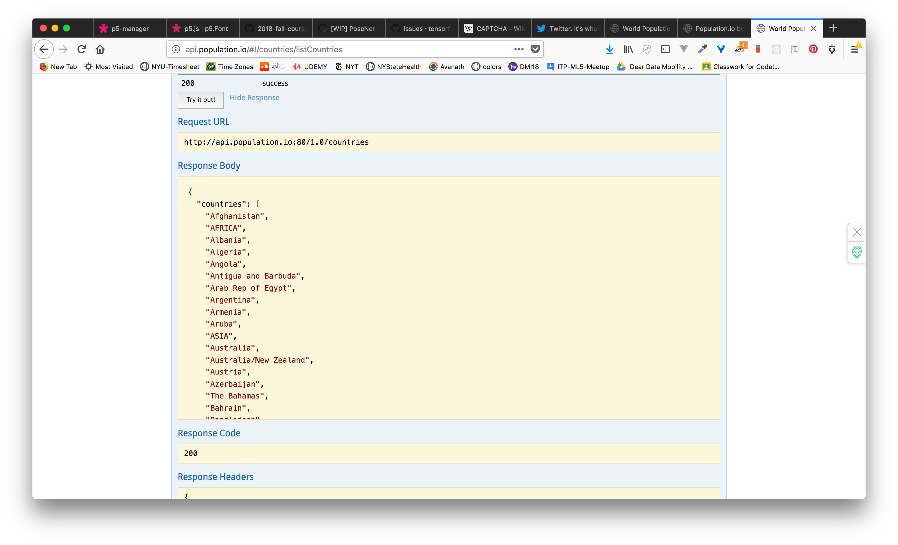
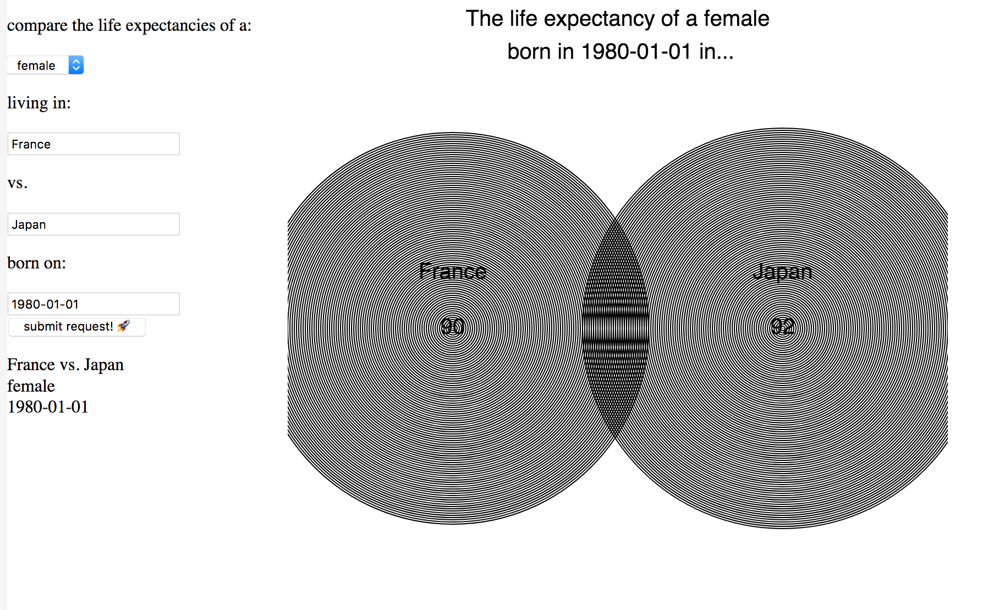
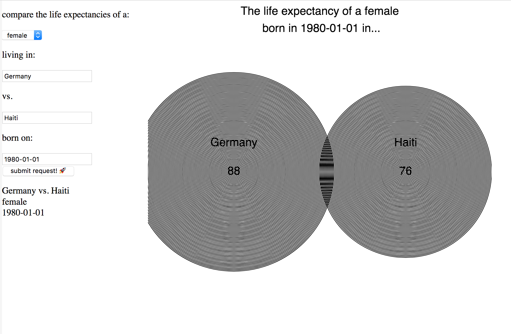

# ASSIGNMENT 06: Life Expectancy Viz
**DUE:** 18 October 2018, 6:00 PM


;
;

## Brief

### Update Oct 12 2018:

NOTE:

As discussed in class, we will try a different methodology for this assignment. Using the existing code base layed out here - [https://github.com/sva-dsi/2018-fall-course/tree/master/examples/life-expectancy-1/process/](https://github.com/sva-dsi/2018-fall-course/tree/master/examples/life-expectancy-1/process/) you will find new ways to show the data that is retrieved from the population.io API.

You may consider to update the styling of the user interface elements as well as try new visual forms to map out the data that is being retrieved.

You will use your growing knowledge of the coding to navigate through the program (link above) as well as your creativity to develop a more intriguing and impactful visualization.

What kinds of metaphors can you map to these comparisons of life expectancy? You may even consider using images (e.g. .svgs) made outside of P5 and bring them in to your project to enhance the visual potential.


### What you're going to do:

Use the population.io life expectancy data to make a visualization that allows people to compare 2 countries and their life expectancy. This means that you will need to use interface elements like buttons and input boxes to allow for user interactions.

This will be your first foray into creating visualizations from data coming from an API! So exciting!

You will query the [population.io API](http://api.population.io/) to get data the life expectancy of a person based on:
- the country of origin: http://api.population.io/#!/countries/listCountries
- sex (male or female)
- and date of birth: YYYY-MM-DD

By querying the API you will get a response that looks something like this:

```
{
  dob: "1980-01-01",
  country: "Germany",
  total_life_expectancy: 88.87111866018876,
  sex: "female"
}
```
#### countries


#### life expectancy image


### Examples

;
;
;


### Process:

The process for creating this visualization is as follows:

- you will need to use several interface elements to achieve this:
  1. 2 input boxes to select countries to compare (e.g. ` createInput()`)
  2. 1 input box for the date of birth (e.g. ` createInput()`)
  3. a dropdown meny to select by sex (male or female) (e.g. `createSelect()`)
  4. a button to submit your GET requests for the data (e.g. `createButton()` & `loadJSON()`)
- you will query the population IO api when your submit button is clicked
  1. first collect all the values from your various inputs
  2. add them to your API url
  3. use the results to create a visualizaiton of the data returned (NOTE: sometimes the response takes awhile)
- style your visualization and interface
  1. add important visual elements like a title and text annotations
  2. experiment with engaging visual encodings that might tell the story better! (e.g. tree rings? )


### Requirements:

- Interface elements using HTML:
  - 1 button
  - 2 input boxes
  - 1 dropdown
  - 1 button
- Visualization:
  - A visualization which visually communicates the life expectancy of two countries
  - A title
- Programmatic elements:
  - retrieving data based on a button press / using callbacks effectively: `loadJSON()`
  - effective use of global and local variables


## Watch videos

- Watch Videos:
  - these should be review:
  - [Loading JSON data from a URL (Asynchronous Callbacks!) - p5.js Tutorial](https://www.youtube.com/watch?v=6mT3r8Qn1VY&index=4&list=PLRqwX-V7Uu6a-SQiI4RtIwuOrLJGnel0r)
  - [Working with APIs in Javascript - p5.js Tutorial](https://www.youtube.com/watch?v=ecT42O6I_WI&index=5&list=PLRqwX-V7Uu6a-SQiI4RtIwuOrLJGnel0r)
  - [API Query with User Input - p5.js Tutorial](https://www.youtube.com/watch?v=4UoUqnjUC2c&index=6&list=PLRqwX-V7Uu6a-SQiI4RtIwuOrLJGnel0r)
  - This is the new stuff:
    - [The Basics of CSS - p5.js Tutorial](https://www.youtube.com/watch?v=zGL8q8iQSQw&list=PLRqwX-V7Uu6bI1SlcCRfLH79HZrFAtBvX&index=7)
    - [CSS Selectors - p5.js Tutorial](https://www.youtube.com/watch?v=sVo8Dbii8OQ&list=PLRqwX-V7Uu6bI1SlcCRfLH79HZrFAtBvX&index=9)
    - [select() and selectAll() with CSS Selectors - p5.js Tutorial](https://www.youtube.com/watch?v=sSQPLIHIzmg&list=PLRqwX-V7Uu6bI1SlcCRfLH79HZrFAtBvX&index=10)
    - [Callbacks on Multiple DOM Elements - p5.js Tutorial](https://www.youtube.com/watch?v=KeZBpeH59Q4&list=PLRqwX-V7Uu6bI1SlcCRfLH79HZrFAtBvX&index=11)
    - [parent() and child() - p5.js Tutorial](https://www.youtube.com/watch?v=eoXLD0Aw1YI&list=PLRqwX-V7Uu6bI1SlcCRfLH79HZrFAtBvX&index=12)
    - [Assigning a CSS Class Dynamically - p5.js Tutorial](https://www.youtube.com/watch?v=KMRgLi2TBhQ&list=PLRqwX-V7Uu6bI1SlcCRfLH79HZrFAtBvX&index=13)
    - [parent() and child() again with Variables - p5.js Tutorial](https://www.youtube.com/watch?v=4OAG_BkQcPE&list=PLRqwX-V7Uu6bI1SlcCRfLH79HZrFAtBvX&index=14)


## Deliverables

* a link to your visualization
* a link to a blog post describing your process and learnings and any difficulties you may have encountered.
* help your classmates! 


## Submission

* Submit your work here: Link to Github Issues
