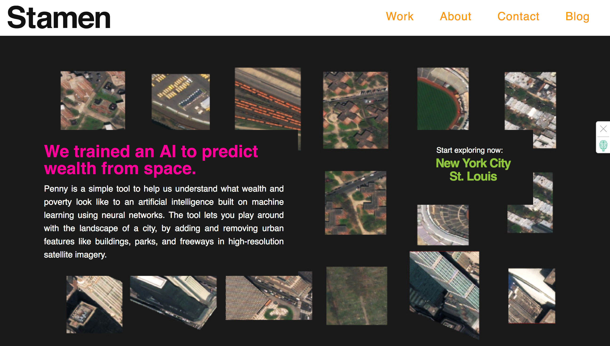

# WEEK `06`
## Data II, Network, & Interface

**Please make sure to log in your Attendance - thank you!**:
👉 [Link to google form]()

## ASSIGNMENT

* [Link to Assignment 6](ASSIGNMENT06.md)

## AGENDA

**DISCUSSION/STUDIO:**

- Week 6: Data II, Network, & Interface
  - Assignment Hacking
    - Step by Step of each Visualization
      - Option 1: https://github.com/sva-dsi/2018-fall-course/tree/master/examples/co2-visualization-1/process
      - Option 2: https://github.com/sva-dsi/2018-fall-course/tree/master/examples/co2-visualization-2/process

  (BREAK: 5 min)

  - Review of data formats
    - csv
    - json
    - Let's revisit this one ==> what to do with nonstructured data?
  - Review of videos HTML and DOM elements:
    - What is HTML?
      - Hyper Text Markup Language!
      - reference: [HTML & CSS: Design and Build Websites](http://www.htmlandcssbook.com/)
      - Every p5 project includes:
        - html (`index.html`) > css (``) > javascript (`script.js`)
        - [HTML, CSS, and JS explained like a house](https://generalassemb.ly/blog/website-is-like-a-house/)
      - HTML uses the DOM or document object model - it's a treelike structure!
    - Creating HTML Elements with JavaScript
      - For now, we do this because it is an nice way to learn how to interact with the browser's DOM (document object model); P5 gives us a bunch of handy methods to work with the dom
      - createP()
      - createElement()
    - Manipulating DOM Elements with html() and position()
      - myElement.position(x,y)
      - myElement.html("some new stuff up in here")
      - the difference between positioning canvas elements and dom elements with .position();
    - Handling DOM Events with Callbacks
      - Event and callbacks!
      - createButton()
      - myButton.mousePressed(callback)
    - Interacting with the DOM using Sliders, Buttons and Text Inputs
      - createSlider(min, max, startingValue)
      - mySlider.value()
      - createInput()
      - myInput.value()
    - Other Events and Inputs
      - myElement.mouseOver()
      - myElement.mouseOut()
      - myInput.input()
    - Events "changed" and "input"
      - mySlider.changed()

  (BREAK: 5 min)

  - Interface I & Assignment:
    - raw interface elements for visualization for Assignment#6;
    - review of inputs, sliders, buttons, etc & listening to event changes (see above)

**Project Highlight - Critique & Feedback**

- [Penny - Stamen: https://stamen.com/work/penny/]
https://hi.stamen.com/announcing-penny-a-playful-ai-that-explores-wealth-and-poverty-in-american-cities-b0d725017249
- Penny is a simple tool to help us understand what wealth and poverty look like to an artificial intelligence built on machine learning using neural networks. The tool lets you play around with the landscape of a city, by adding and removing urban features like buildings, parks, and freeways in high-resolution satellite imagery.

## PRACTICE

## READINGS

## ADDITIONAL RESOURCES

* from last week, for the group looking at women in the workplace: http://projectinclude.org/
* [Fundamentals of Data Visualization, Claus O. Wilke](https://serialmentor.com/dataviz/)
* [Hacking It Out: When CORS won’t let you be great](https://medium.com/netscape/hacking-it-out-when-cors-wont-let-you-be-great-35f6206cc646)
