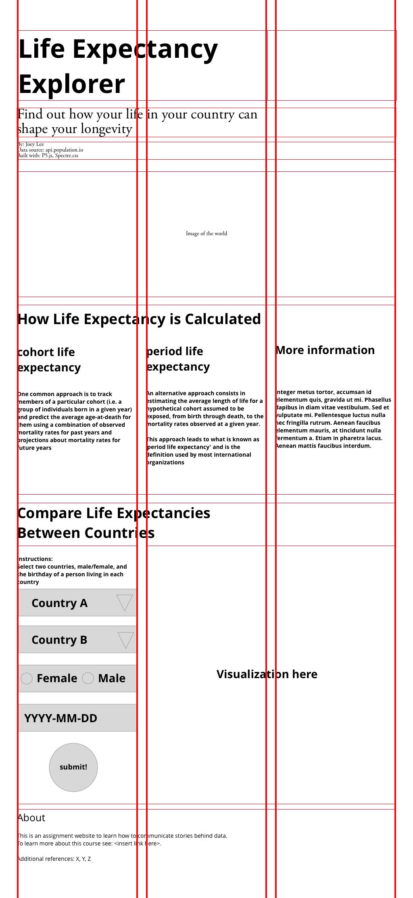

# ASSIGNMENT 07: Life Expectancy Revisited
**DUE:** 25 October 2018, 6:00 PM

## Brief

Using your new knowledge of creating grids and styling in CSS, your goal this week will be to create a webpage around your visualization. This will give you an additional opportunity to think about "everything around the chart". 

In this assignment, you will create a webpage layout that leads your readers to the web application you've built that allows people to compare the life expectancy of two countries. 

It is up to you to decide how to pitch your story, but the idea is that you must use the data from the population.io API to help your readers better understand what they may be seeing. 

You may consider:

1. specific details which explain possibly why the life expectancy of the countries are the way that they are. 
2. specific details about the way the life expectancy is calculated. 
3. how such statistics may affect other aspects of people's lives such as the way aid is allocated in developing countries or how it may actually reflect or hide other variables about more regional differences within countries. 

You might also think about using other data from the population.io API that could support your argumentation. 

You can use this as a template:

https://github.com/sva-dsi/2018-fall-course/tree/master/examples/html-css-process/process

Here's our demo from class:

https://editor.p5js.org/joeyklee/sketches/Hk2KHaUo7

<!-- - Create a copy of your Life Expectancy Visualization and develop a styled web page around the interactive visualization.
    - use a combination of layout, typography, and color to communicate the data being presented and any insights you've found while working with the data
    - Can you think of creative ways to reinterpret the data? -->

## Requirements

* You will:
  * use your new CSS skills to build a grid layout
  * present new content and information about the topic of life expectancy and why it is interesting and important for people to consider
  * learn important skills about integrating your design skills with development - you will be the designer/developer/journalist! 
  * submit your website url 

## Videos to watch:
- Watch Videos:
    - required:
      - Arrays and loops reviewed:
        - [7.1: What is an array? - p5.js Tutorial](https://www.youtube.com/watch?v=VIQoUghHSxU) | ~13 min
        - [7.2: Arrays and Loops - p5.js Tutorial](https://www.youtube.com/watch?v=RXWO3mFuW-I) | ~9 min
      - Objects in Javascript:
        - [Introduction to Object-Oriented Programming with ES6 - p5.js Tutorial](https://www.youtube.com/watch?v=xG2Vbnv0wvg&index=22&t=0s&list=PLRqwX-V7Uu6Zy51Q-x9tMWIv9cueOFTFA) | ~2 min
        - [Classes in JavaScript with ES6 - p5.js Tutorial](https://www.youtube.com/watch?v=T-HGdc8L-7w&index=23&t=4s&list=PLRqwX-V7Uu6Zy51Q-x9tMWIv9cueOFTFA) | 20 min
        - [Constructor Arguments with Classes in JavaScript - p5.js Tutorial](https://www.youtube.com/watch?v=rHiSsgFRgx4&index=24&t=2s&list=PLRqwX-V7Uu6Zy51Q-x9tMWIv9cueOFTFA) | 8 min
        - [Mouse Interaction with Objects - p5.js Tutorial](https://www.youtube.com/watch?v=TaN5At5RWH8&index=29&t=0s&list=PLRqwX-V7Uu6Zy51Q-x9tMWIv9cueOFTFA)
        - [Arrays of Objects](https://www.youtube.com/watch?v=fBqaA7zRO58) | ~14 min
      - A static map in P5js:
        - [Mapping Earthquake Data](https://www.youtube.com/watch?v=ZiYdOwOrGyc&index=11&list=PLRqwX-V7Uu6a-SQiI4RtIwuOrLJGnel0r) | 30 mins
    - **Optional**: Object Oriented Programming will open up many new possibilities
      - [Removing Objects from Arrays - p5.js Tutorial](https://www.youtube.com/watch?v=tA_ZgruFF9k&index=30&t=0s&list=PLRqwX-V7Uu6Zy51Q-x9tMWIv9cueOFTFA)
      - [Object Communication Part 1 - p5.js Tutorial](https://www.youtube.com/watch?v=W1-ej3Wu5zg&index=31&t=0s&list=PLRqwX-V7Uu6Zy51Q-x9tMWIv9cueOFTFA)
      - [Object Communication Part 2 - p5.js Tutorial](https://www.youtube.com/watch?v=5Q9cA0REztY&index=32&t=0s&list=PLRqwX-V7Uu6Zy51Q-x9tMWIv9cueOFTFA)
      - [Objects and Images - p5.js Tutorial](https://www.youtube.com/watch?v=i2C1hrJMwz0&index=33&t=0s&list=PLRqwX-V7Uu6Zy51Q-x9tMWIv9cueOFTFA)

NOTE: Next week we're going to do some mapping!

## Submission

* Submit your work here: https://github.com/sva-dsi/2018-fall-course/issues/19
