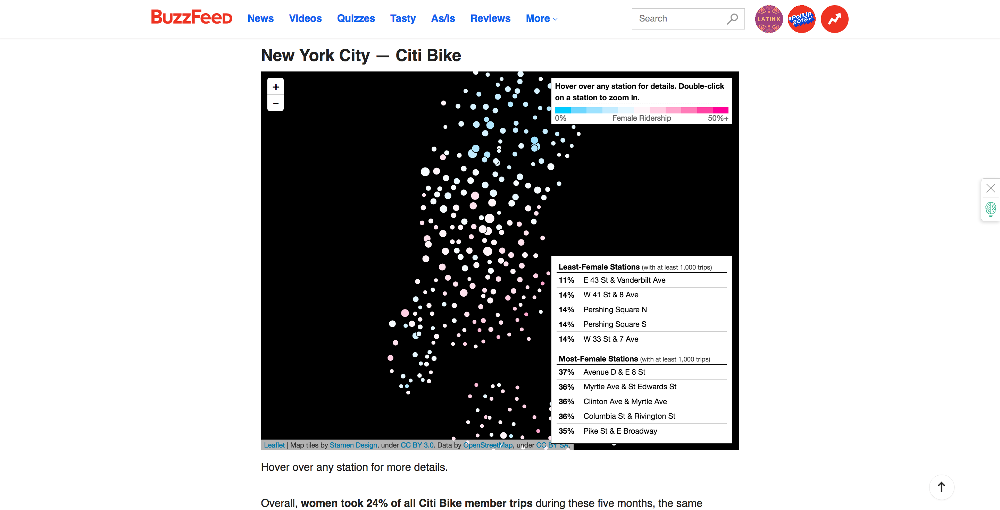

# WEEK `07`
## Everything Around the Chart

**Please make sure to log in your Attendance - thank you!**:
👉 [Link to google form](https://goo.gl/forms/dC4nFJq8eRyesSYN2)

## ASSIGNMENT

* [Link to Assignment 7](ASSIGNMENT07.md)

## AGENDA

**DISCUSSION:**

**Part 1**
* Review of Assignment#6:
  * Questions? Comments?
  * Discussion about experience of working with existing code
* Mid-review / Reflection:
  * [slides](https://docs.google.com/presentation/d/1PMcNRBJtlXi4Xxx9_amaXduqozj-mCFihwIkzeF8KFM/edit?usp=sharing)

**Part 2: 7:00 - 7:30/45**
* Guest Speaker: [Jeremy Singer-Vine](https://www.jsvine.com/), 7:00PM - 7:30 PM
  * Data scientist, journalist, reporter - Currently Data Editor at Buzzfeed
  * Previously at the Wall Street Journal & co-named a finalist for the 2014 Pulitzer Prize in National Reporting
  * Media:
    * Talk: [Transparent, Reproducible Journalism, Open Data Science](https://www.youtube.com/watch?v=6DcXE0NP84A)
    * DataIsPlural newsletter for interesting datasets: https://tinyletter.com/data-is-plural
    * An interview with Jeremy: https://www.poynter.org/news/meet-buzzfeed-editor-whom-data-journalists-love
  * Some projects:
    * A really cool set of open source tools: https://github.com/jsvine
    * Creating a database of nuclear waste sites in the US: https://www.youtube.com/watch?v=mbCjrtu6k6U
    * [Gender Gap in Bicycle Riding](https://www.buzzfeed.com/jsvine/these-maps-show-a-massive-gender-gap-in-bicycle-riding)
  * Links from Jeremy's Talk:
    * https://www.buzzfeednews.com/article/heidiblake/the-tennis-racket
    * https://www.buzzfeednews.com/article/johntemplon/black-voters-underrepresented-in-biggest-midterms
    * https://www.buzzfeednews.com/article/lamvo/gentrification-complaints-311-new-york
    * https://www.buzzfeednews.com/article/peteraldhous/hidden-spy-planes
    * http://drafts.jsvine.com/the-magic-criteria/ 
    * https://www.ipsos.com/en/about-us
    * https://www.buzzfeednews.com/article/lesterfeder/this-is-how-23-countries-feel-about-transgender-rights
    * https://www.buzzfeednews.com/article/buzzfeednews/about-buzzfeed-news
    * https://journalism.columbia.edu/workbench-data-platform-all-reporters

**STUDIO:**
- CSS Styling & Navigating the DOM
  - css selections:
    - html and css selectors: `#id`, `.class`. and tag
    - `select()`
    - `selectAll()`
  - css styling
    - we know we can affect lots of properties such as `background`, `font-family`, the layout and much more.
    - we can even do css animations!
    - A cool CSS game for practice:
      - https://flukeout.github.io/
  - keeping track of events
    - e.g. mouseOver and mouseOut on many elements
    - how the keyword `this` is passed during callbacks
  - DOM heirarchy:
    - parent(), child()
    - "all of these dom elements were meant to be blueberries" - @Shiffman // applying a class dynamically: https://www.youtube.com/watch?v=KMRgLi2TBhQ&list=PLRqwX-V7Uu6bI1SlcCRfLH79HZrFAtBvX&index=13
- External CSS Libraries:
  - CSS frameworks help you to create (often mobile friendly) web pages by using an defined set of classes. They can be really helpful if you want to mock up a site quickly or build a front end web page. As a designer in a data viz collaboration it can be hugely helpful to think through your story telling while prototyping how you envision your story to be told. CSS frameworks aren't necessary for doing this, and sometimes can make things more complicated, but it is worth to know how they work.
  - There are a million of CSS frameworks out there - just web search: CSS framework - but one I've come across that seems alright is the [Spectre CSS Library](https://picturepan2.github.io/spectre/getting-started.html#introduction). If you want to look at google's css framework, check out [Materialize css](https://materializecss.com/)

## Resources for building the web:
NOTE: Udemy's [Advanced Web Developer Bootcamp](https://www.udemy.com/the-advanced-web-developer-bootcamp/), as intimidating as it sounds, does a great overview of some of the more technical things if you want to get more instruction on these. 

### layout:
  - Flexbox:
    - [Flexbox Nº 8. of HTML & CSS Is Hard A friendly tutorial for modern CSS layouts](https://internetingishard.com/html-and-css/flexbox/)
    - [Mozilla's Basic concepts of flexbox](https://developer.mozilla.org/en-US/docs/Web/CSS/CSS_Flexible_Box_Layout/Basic_Concepts_of_Flexbox)
  - CSS Grid (I haven't used it for any projects but people seem to love it):
    - [learn css grid](https://learncssgrid.com/)
  - CSS Frameworks:
    - [Spectre CSS Library](https://picturepan2.github.io/spectre/getting-started.html#introduction)
    - [Materialize css](https://materializecss.com/)
    - [Bootstrap CSS](https://getbootstrap.com/docs/3.3/)
  - **Readings**:
    - [Grid Systems, JM Brockman](https://www.amazon.com/Grid-Systems-Graphic-Design-Communication/dp/3721201450)
    - [Grid Systems: Principles of organizing type, Kimberly Elam](https://www.amazon.com/Grid-Systems-Principles-Organizing-Design/dp/1568984650)
    - [Intro to grids in web design](https://webdesign.tutsplus.com/articles/a-comprehensive-introduction-to-grids-in-web-design--cms-26521)
### typography and text:
  - Lorem Ipsum filler text generators
    - [10 Hilarious Lorem Ipsum Generators for Web Designers](https://theultralinx.com/2013/08/10-hilarious-lorem-ipsum-generators-web-designers/)
  - Free web fonts:
    - [Google Fonts](https://fonts.google.com/)
  - **Readings**:
    - [Typographic Systems, Kimberly Elam](https://www.papress.com/html/product.details.dna?isbn=9781568986876)
    - [Thinking with Type, Ellen Lupton](http://thinkingwithtype.com/)
### color:
  - [Color Hexa](https://www.colorhexa.com/)
  - [HTML Color Codes](https://htmlcolorcodes.com/)
  - [Color brewer](http://colorbrewer2.org/#type=sequential&scheme=BuGn&n=3)
  - **Readings**:
    - [Intro to Color w/ Aurelia](https://github.com/sva-dsi/2017-fall-course/blob/master/lectures/colors.md)
    - [Your Friendly Guide to Colors in Data Visualisation](https://blog.datawrapper.de/colorguide/)
    - [A color palette optimized for data visualization](http://www.mulinblog.com/a-color-palette-optimized-for-data-visualization/)
### wireframing and prototyping tools:
  - [Sketch](https://www.sketchapp.com/)
  - [InVision](https://www.invisionapp.com)
  - Others:
    - [Webflow](https://webflow.com/)
    - [Google Web Designer](https://www.google.com/webdesigner/) // this is new I think(?)

 

## READINGS
* [What I Learned Recreating One Chart Using 24 Tools, Lisa Rost ](https://source.opennews.org/articles/what-i-learned-recreating-one-chart-using-24-tools/)
* [Dominkus Bauer, The superpower of interactive datavis? A micro-macro view!](https://do.minik.us/blog/a-micro-macro-view)
* [Lynn Cherney, Data Visualization “Versus” UI and Data Science](https://medium.com/@lynn_72328/data-visualization-versus-ui-and-data-science-d59182d58af4)
* [Jer Thorp, Make Data More Human](https://www.ted.com/talks/jer_thorp_make_data_more_human)

## ADDITIONAL RESOURCES

* [The hidden ethics of our personal data | Daniel Goddemeyer & Dominikus Baur | TEDxUCLouvain](https://www.youtube.com/watch?v=MJeXyPFYVEY)
* [Dominkus Bauer, data vis blog](https://do.minik.us/#writing)
* [How to Master the Design Grid](https://medium.com/by-filament/how-to-use-a-design-grid-587f40cc9a0d)
* [Building Better UI Designs With Layout Grids](https://www.smashingmagazine.com/2017/12/building-better-ui-designs-layout-grids/)