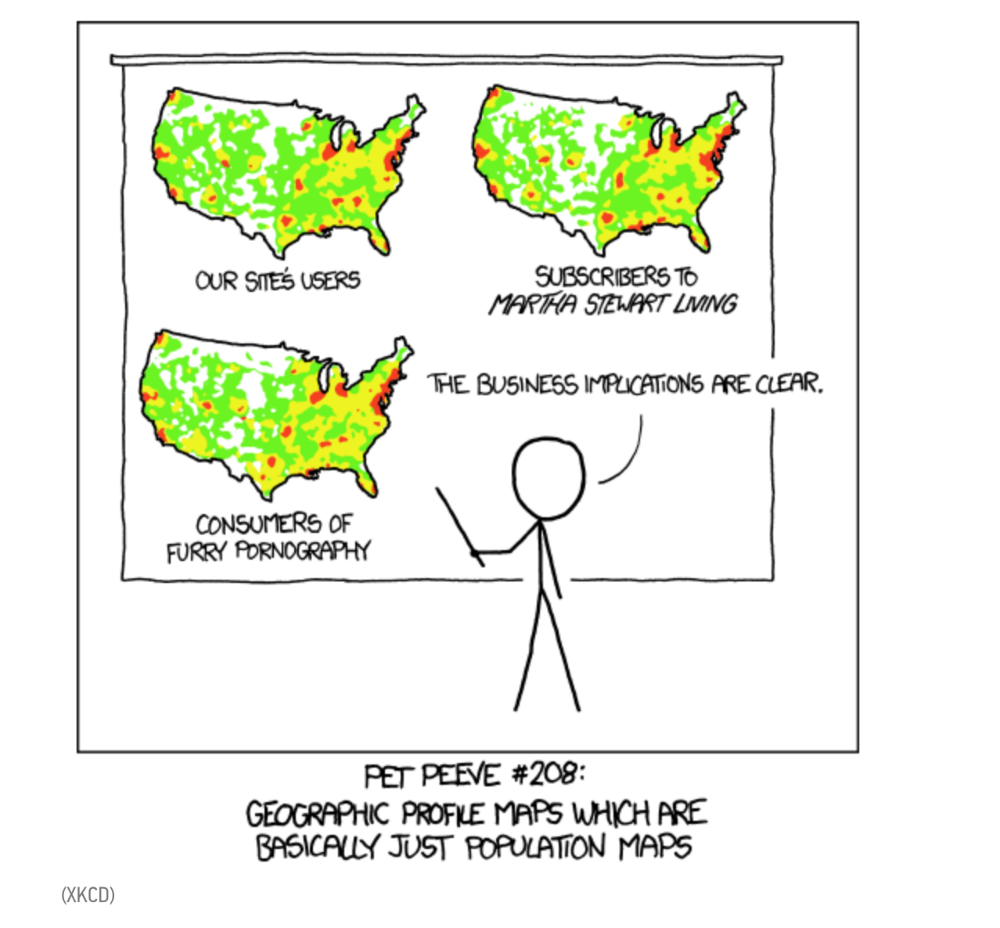
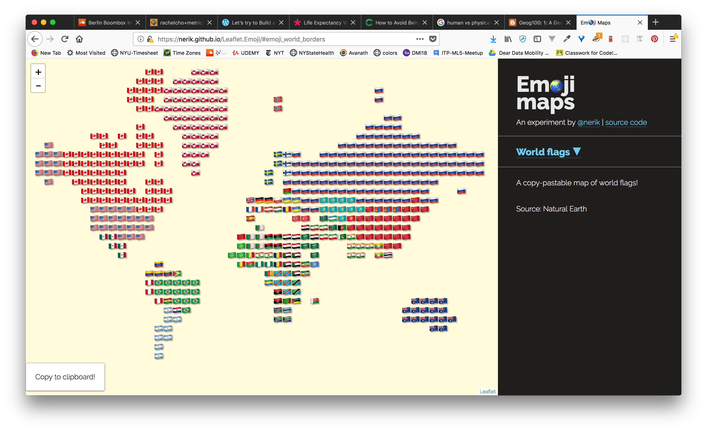
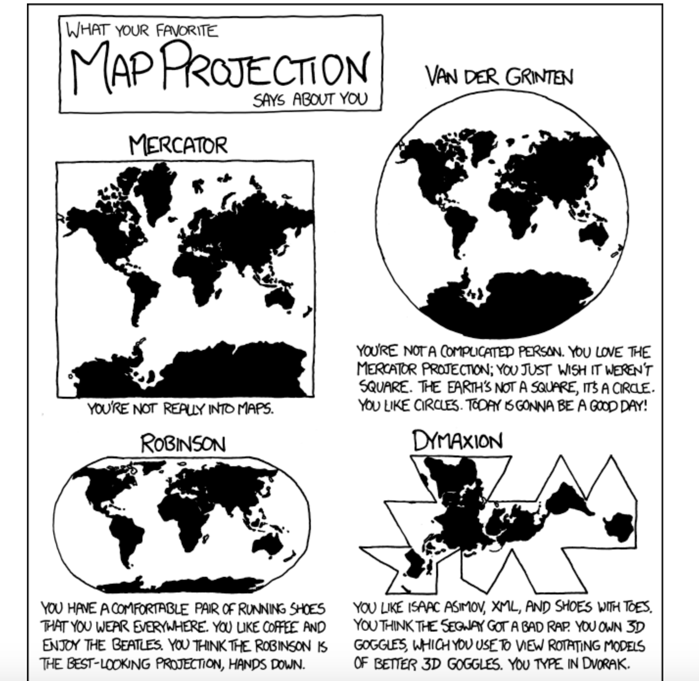
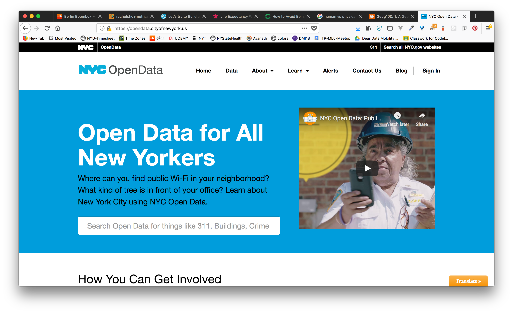
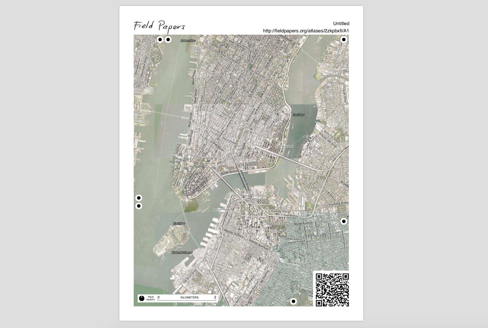

# WEEK `08`
## (Counter)Mapping and Cartographics

**Please make sure to log in your Attendance - thank you!**:
👉 [Link to google form]()

## (UN)ASSIGNMENT

* No assignment this week. 
* Some helpful tips:
  * Take the time to go through the last 8 weeks, refine and practice what you've learned, and browse some of the readings and links provided.
  * Go back through all the data vis concepts and code components we've covered and try to organize them visually or in a blog post.

## AGENDA

**DISCUSSION:**

* Guest Speaker: Brandyn Friedly
  * critical geographer, mapmaker & developer
  * interested in digital humanities, arts, education, media, environment. #maps.
  * [@brandynfriedly](https://twitter.com/brandynfriedly?lang=en)
  * [slides: Affective Mapping - Designing for Social Change](https://bfreeds.github.io/nacis2018-affectivemapping/)

## Overview of Mapping

> "everything is related to everything else, but near things are more related than distant things." - Waldo Tobler

* Mapping, Map Making, and Cartography
  * [Tobler's first law of geography](https://en.wikipedia.org/wiki/Tobler%27s_first_law_of_geography) - "everything is related to everything else, but near things are more related than distant things."
  * [City lab, When Maps Lie](https://www.citylab.com/design/2015/06/when-maps-lie/396761/) 

  * Geography ≠ Mapping:
    * Geography:
      * > Geography is often defined in terms of two branches: human geography and physical geography. Human geography deals with the study of people and their communities, cultures, economies, and interactions with the environment by studying their relations with and across space and place.[6] Physical geography deals with the study of processes and patterns in the natural environment like the atmosphere, hydrosphere, biosphere, and geosphere.  - [Wikipedia](https://en.wikipedia.org/wiki/Geography)

  * Cartography defined:
    * the art and science of making maps; dealing with representation and generalization - see [Wikipedia](https://en.wikipedia.org/wiki/Cartography)
    * > The production and study of maps and charts. Cartography is a system of information which is used to communicate something of the real world to other people; the map is a model, to be decoded by the map reader; see Lloyd (1989) AAAG 79,1. .... All maps are approximations; their clean lines and colours don't reflect the muddled nature of the reality they represent, and they can easily be used to support a point of view; ‘a whole arsenal of devices may be used for [persuasive cartography]…to influence opinion rather than to inform the reader’ ( N. Thrower 1996 ). So that the reader is not distracted by ‘noise’—anything which stands in the way of understanding—the map has to be encoded using easily understandable signs, symbols, lettering, and lines; see Board and Taylor ( 1977 ) TIBG 2, 1. F. Farinelli ( 1989 ) observed that reason ‘is nothing more than the protocol of…the cartographic image…the history of geography is the history of the confusion between the model and the reality’. See J. Pickles ( 2004 ) and C. Jacob ( 2006 ). - [UCLA Guides](https://guides.library.ucla.edu/maps/cartography) - Definition from: "Cartography" A Dictionary of Geography. Susan Mayhew. Oxford University Press 2009 Oxford Reference. Oxford University Press. UC - Los Angeles. 16 November 2010.

  * Spatial Analysis & Spatial Statistics:
    * I pull this category out from Geography and Cartography because it often lives out of those domains and is often instrumentalized in other disciplines and interests. 
      * > In general, "... includes any of the formal techniques which study entities using their topological, geometric, or geographic properties." 
      * > "Gabriel thought maps should be banned. They gave the world an order and reasonableness it didn’t possess." - [Derek Gregory, Gabriel's Map: Cartography and Corpography in Modern War](https://geographicalimaginations.files.wordpress.com/2012/07/gregory-gabriels-map-published.pdf)

  * Critical Mapping: https://mvmtbldg.wordpress.com/2011/02/20/critical-mapping/ 
      * > "critical mapping acknowledges that maps are not neutral conveyors of fact; more importantly, it embraces the idea that maps have agency"

  * Why we should care about mapping and geographic data?
    * e.g. [Code/Space](https://mitpress.mit.edu/books/codespace)
    * e.g. [US v.s. Jones](https://www.law.cornell.edu/supremecourt/text/10-1259) 
      * > "Disclosed in [GPS] data . . . will be trips the indisputably private nature of which takes little imagination to conjure: trips to the psychiatrist, the plastic surgeon, the abortion clinic, the AIDS treatment center, the strip club, the criminal defense attorney, the by-the-hour motel, the union meeting, the mosque, synagogue or church, the gay bar and on and on." ... The result of Jones was that government has to get a warrant to put a GPS tracker on your car. But if you use, or drive for, Uber, that doesn't mean much. Theoretically, Uber can just fork your GPS data over without one. via [motherboard](https://motherboard.vice.com/en_us/article/53ddwb/uber-knows-too-much-about-you)
    * e.g. [Why Google Maps Shows You Different Borders, Depending On Where You Are](https://www.fastcompany.com/3058283/why-google-maps-shows-you-different-borders-depending-on-where-you-are)
      * > “Google customizes its maps to adhere to each individual country’s beliefs and laws, so that its maps do not show a single and objective reality, but rather affirm existing perspectives of the world.” - Ethan Merel in the Columbia Journal of Transnational Law. 
      * > Historically, cartographers have striven to make their maps as objective as possible. -- NOT TRUE AT ALL // Cartographers reflect their biases, their politics (and those of their stakeholders), their ignorances, their imaginations, their laziness, and the integrity or lacktherof of the data they use to make maps, this has been true since the beginning of maps.
    * e.g. see examples in web mapping below or Mimi's or Sam's talk below.

## Geographic representation:

* Maps come in all shapes and sizes and uses - General or Thematic:
    * e.g. Tactile maps:  [Inuit Atlases](https://decolonialatlas.wordpress.com/2016/04/12/inuit-cartography/)
    * e.g. Medieval Maps: [Mappa mundi](https://en.wikipedia.org/wiki/Mappa_mundi)
    * e.g. Maps that reveal: [Spies in the sky](https://www.buzzfeednews.com/article/peteraldhous/spies-in-the-skies#.evqNZp76N)
    * e.g. Imaginary Maps:  [Invisible Cities](https://opendot.github.io/ml4a-invisible-cities/gallery/)
    * e.g. Narrative maps: [Everything Sings](http://sigliopress.com/book/everything-sings/)
    * e.g. Future maps: [Imagining an MTA fare increase](http://lifewinning.com/projects/fare-hikes/)
    * e.g. emoji maps: [Erik Escoffier Emoji Mapping](https://nerik.github.io/Leaflet.Emoji/#emoji_nyc)

## Geographic Data

### Projections

* Maps need to convert the blobby 3D earth onto a flat surface. In order to do this cartographers have come up with mathematical formulas that make it possible to unfold that blobby 3D earth into 2D - these mathematical formulas are called Projections. 
* However projections are not all created equal. They each are designed for a specific purpose. In their unfolding of the earth, each attemps to do their best to preserve:
  * Conformality - distortion of shape
  * Distance - distortion of distance
  * Area - distortion of size
  * Direction - distortion of direction
* Projection types:
  * Conformal - local/small shapes are preserved
  * Equal Area - areas are preserved
  * Equidistant - distance from single location to other locations preserved
  * Azimuthal - direction from single location to other locations preserved
* To learn more check out [Mike Foster's Projection Presentation](http://mjfoster83.github.io/projections/index.html#/60)
* Ah-ha's with projections:
  * sometimes you'll acquire some geographic data and the coordinates will be unlike anything you've ever seen. Huge numbers that don't fit in the -180/180, -90/90. Quite likely those values are in a local projection system. Your goal would be to find out what that original projection those data come in and project them to a coordinate system that you're using to fit your visualization (quite likely the web mercator)

### Geo Data - what does it look like? [Raster vs. Vector Data](https://www.gislounge.com/geodatabases-explored-vector-and-raster-data/), [more on Raster vs. Vector](https://gisgeography.com/spatial-data-types-vector-raster/)

* lat/lon, addresses, [what3words](https://what3words.com/)

/cdn.vox-cdn.com/uploads/chorus_image/image/50341137/cf-nyc-citywide.0.jpg)

* Common vector data:
  * [.geojson](https://macwright.org/2015/03/23/geojson-second-bite.html) // and it's compressed cousin, [topojson](https://github.com/topojson/topojson/wiki/Introduction)
  * [.shp](https://en.wikipedia.org/wiki/Shapefile)
  * .xml / [.kml](https://en.wikipedia.org/wiki/Keyhole_Markup_Language) / [.gml](https://en.wikipedia.org/wiki/Geography_Markup_Language) 
  * ... and there's a [whole slew of them](https://en.wikipedia.org/wiki/GIS_file_formats).

* Common [raster data](http://desktop.arcgis.com/en/arcmap/10.3/manage-data/raster-and-images/what-is-raster-data.htm):
  * .geotiff / .tif
  * .jpeg / .jpeg2000
  * .img
  * ... and there's a [whole slew of them](https://en.wikipedia.org/wiki/GIS_file_formats).
  
###  where to get existing data?

* [Aure's List of NYC Data](https://github.com/sva-dsi/2017-fall-course/blob/master/lectures/maps.md#mapping-data)
* [Awesome lists public data](https://github.com/awesomedata/awesome-public-datasets)
* [Jeremy Singer Vine - Data is Plural](https://tinyletter.com/data-is-plural)
  * and [the list here](https://docs.google.com/spreadsheets/d/1wZhPLMCHKJvwOkP4juclhjFgqIY8fQFMemwKL2c64vk/edit)
* [NYC Open Data Portal](https://opendata.cityofnewyork.us/)
* [Crisis Lex](http://crisislex.org/tweet-collections.html)
* Universities often have data available:
  * [UCLA](https://gis.ucla.edu/geodata/)
  * [Columbia University](https://geodata.library.columbia.edu/)
  * ... web search e.g.: geodata + UC berkeley 
* [USGS Earth Explorer](https://gisgeography.com/usgs-earth-explorer-download-free-landsat-imagery/)
* [Carto Data Observatory](https://carto.com/developers/data-observatory/)

###  how to collect/create geographic data?

* [Field Papers](http://www.fieldpapers.org/): digitizing paper maps
* [Mapwarper](http://maps.nypl.org/warper/): geo-rectify non geographic images
  * [Mapwarper tutorial](http://history2016.doingdh.org/map-warper-tutorial/)
* With Sensors/Devices:
  * Satellites!
    * e.g. [USGS NAIP](https://www.fsa.usda.gov/programs-and-services/aerial-photography/imagery-programs/naip-imagery/)
    * e.g. [NASA Landsat program](https://landsat.usgs.gov/landsat-data-access)
    * e.g. [OCO2 Satellite](https://oco.jpl.nasa.gov/)
  * Cell phones:
    * Active:
      * e.g. [Reporter App](http://www.reporter-app.com/), [Nomi App](https://nomie.app/), [Strava](https://www.strava.com/mobile)
      * your camera
    * Passive:
      * e.g. [Google maps timeline](https://support.google.com/maps/answer/6258979?co=GENIE.Platform%3DDesktop&hl=en)
  * Social Media platforms
    * e.g. twitter, instagram, facebook
* Using statistics and creating models
  
## Overview of Tools

* [McConchie, Schechter, and Diamond - Anatomy of a web map](http://maptime.io/anatomy-of-a-web-map/#0)
* desktop tools
  * [QGIS](https://qgis.org/en/site/) (free and open source)
  * [ESRI's ArcGIS](https://www.esri.com/en-us/arcgis/about-arcgis/overview) (not free or open source)
* commandline tools: some examples...
  * [GDAL - geospatial data abstraction library](https://www.gdal.org/)
  * [Tippecanoe - turn spatial data to vector tiles](https://github.com/mapbox/tippecanoe)
  * [Rasterio - working with raster data](https://github.com/mapbox/rasterio)
    * [Rio-color - color correction plugin for rasterio](https://github.com/mapbox/rio-color)
* web tools
  * [Carto](https://carto.com/)
  * [Mapbox Studio](https://www.mapbox.com/mapbox-studio/)
  * [Mapshaper](https://mapshaper.org/)

##  Web Mapping
* > Web maps are digital maps that are (often) produced and published on the web. Web maps can be interactive and often times are, but don't always need to be. The interactivity capabilities of the web allow for maps to be dynamic, allowing people to get an overview of the data, zoom and filter, and get details on demand. 
* e.g. [American Panorama - Atlas of the US History](http://dsl.richmond.edu/panorama/)
* e.g. [Stamen, Surging Seas](https://stamen.com/work/surging-seas/)
* e.g. [Flights to Rome](https://flightstorome.moovellab.com/)
* e.g. [Racial Dot Map](https://demographics.virginia.edu/DotMap/)

## Recommended READINGS and Referecnes

- [City lab, How maps lie](https://www.citylab.com/design/2015/06/when-maps-lie/396761/) 
- [Sorry, We Have No Imagery Here: When Google Earth Goes Blind, Meg Van Huygen](https://www.atlasobscura.com/articles/investigating-censored-spots-on-google-earth)
- Apple Maps vs Google Maps: https://www.justinobeirne.com/cartography-comparison
- Atlas of Radical Cartography: http://www.an-atlas.com/contents/iaa_iaa.html
- [How Google Builds Its Maps—and What It Means for the Future of Everything](https://www.theatlantic.com/technology/archive/2012/09/how-google-builds-its-maps-and-what-it-means-for-the-future-of-everything/261913/)

- Talks and multimedia:
  - [Mimi Onouha at Eyeo 2017, How We Became Machine Readable ](https://vimeo.com/233011125)
  - [Sam Sinyangwe at Eyeo 2017 | Using Data and Technology to End Police Violence](https://vimeo.com/232656871)
  - Reply All Podcast:
    - About: this two part series is about [CompStat](https://en.wikipedia.org/wiki/CompStat), a policing software and methodology that was developed to help make NYC safer. Keep your ears open for the ways that mapping, data, and statistics are not neutral, but rather reflect the politics of the state and very human agendas that the numbers hide.
    - [The Crime Machine Part 1](https://www.gimletmedia.com/reply-all/127-the-crime-machine-part-i)
    - [The Crime Machine Part 2](https://www.gimletmedia.com/reply-all/128-the-crime-machine-part-ii)
- Hello Web Maps:
  - [McConchie, Schechter, and Diamond - Anatomy of a web map](http://maptime.io/anatomy-of-a-web-map/#0)
  - [Maptime Boston Intro to Web Maps](http://maptimeboston.github.io/web-maps-101/)
  - [Everything is Spatial](https://mimionuoha.github.io/spring2017-digitalmapping/weekone/#/)
- projections:
  - Web Mercator Wikipedia: https://en.wikipedia.org/wiki/Web_Mercator_projection
  - The true size of: https://thetruesize.com/#?borders=1~!MTUzNTU1MjU.NTI3ODE2NQ*Mjc0MTIwODA(MTAwODAwNDk~!CONTIGUOUS_US*MTAwMjQwNzU.MjUwMjM1MTc(MTc1)MA~!IN*NTI2NDA1MQ.Nzg2MzQyMQ)MQ~!CN*OTkyMTY5Nw.NzMxNDcwNQ(MjI1)Mg
  - XKCD Map Projections: https://xkcd.com/977/
  - projection face: http://bl.ocks.org/awoodruff/9216081
  - Projection wizard: http://projectionwizard.org/
  - jason davies all the projections: https://www.jasondavies.com/maps/
  - project it yourself: https://macwright.org/2012/03/12/project-it-yourself.html
  -  Projections and Coordinate Systems for the Modern Mapper: http://mjfoster83.github.io/projections/index.html#/

## ADDITIONAL RESOURCES

- Coding Train, [Mapping Earthquakes, Coding Challenge](http://thecodingtrain.com/CodingChallenges/057-mapping-earthquake-data.html) || [Code](https://github.com/CodingTrain/website/blob/master/CodingChallenges/CC_057_Earthquake_Viz/sketch.js)
- Mapmaker cheatsheet: https://github.com/tmcw/mapmakers-cheatsheet

## Interesting projects & people:

- [Data walking](http://datawalking.com/story.html)
- [Stamen Design](https://stamen.com/) 
- Erik Escoffier [Emoji Mapping](https://nerik.github.io/Leaflet.Emoji/#emoji_nyc)
  - [Satellite Studio](http://satellitestud.io/)
- Moovel Lab:
  - [What the Street?!](https://lab.moovel.com/projects/what-the-street)
  - [Roads to Rome](https://lab.moovel.com/projects/roads-to-rome)
  - [Flights to Rome](https://flightstorome.moovellab.com/ ) 
- [Ingrid Burrington](http://lifewinning.com/tag/maps/) 
- [Matthew Wilson](http://lifeaftergis.blogspot.com/)
- [Center for Urban Pedagogy](http://welcometocup.org/)
- [LA Times, LA Fire Department Response Times](http://graphics.latimes.com/how-fast-is-lafd/#10/34.0111/-118.5322)
- [Buzzfeed, Spies in the sky](https://www.buzzfeednews.com/article/peteraldhous/spies-in-the-skies#.evqNZp76N)
- [Eric Frischer, Locals vs. Tourists](https://www.mapbox.com/labs/twitter-gnip/locals/#13/40.7142/-73.9406)
- [Submarine cable map](https://www.submarinecablemap.com/#/submarine-cable/pacific-light-cable-network-plcn)
- [Jenny O' Dell](http://www.jennyodell.com/satellite.html)
- NY Times, A Rogue State Along Two Rivers - [How ISIS Came to Control Large Portions of Syria and Iraq](https://www.nytimes.com/interactive/2014/07/03/world/middleeast/syria-iraq-isis-rogue-state-along-two-rivers.html): map scrolling example: 
- [Josh Begley, Prison Maps](http://prisonmap.com/)
- [Invisible Cities - Machine Learning Style Transfer](https://opendot.github.io/ml4a-invisible-cities/gallery/)
- [Land Lines](https://lines.chromeexperiments.com/)
- [Shannon Mattern](https://vimeo.com/287094515)
- and so many more!!!

## Tools:
- Field Papers: http://www.fieldpapers.org/
  - offline, paper based mapping that can be digitized
- Carto: https://carto.com/
  - web mapping and location intelligence platform
- Mapbox: https://www.mapbox.com/mapbox-studio/
  - web mapping platform to style maps and data
- Mapshaper: https://mapshaper.org/
  - a commandline meets web browser tool. one of the oldest tools in the open source mapping world. 
- Data conversion tools:
  - OGRE: https://ogre.adc4gis.com/
  - Geojson.io: http://geojson.io/#map=2/20.0/0.0
- static map maker: https://staticmapmaker.com/mapbox/

## Libraries:
- Mappa.js: https://mappa.js.org/docs/introduction-to-web-maps.html
- Leaflet.js: https://leafletjs.com/
- MapboxGL.jS: https://www.mapbox.com/mapbox-gl-js/api/
- Carto.js: https://carto.com/docs/carto-engine/carto-js/
- D3.js: 
  - more of a general purpose library for data vis but comes with a bunch of geo functionality. NOTE: not for the novice javascript person
  - https://d3indepth.com/geographic/
  - [D3 Geo library](https://github.com/d3/d3-geo)
  - [DataMaps](http://datamaps.github.io/) // this is kind of interesting

## Workshops/Tutorials:

- Leaflet and p5js:
  - emoji mapping: https://github.com/joeyklee/map-image-emoji
- Mapbox js:
  - scroll driven map adventure: https://github.com/joeyklee/mapboxjs-scroll-driven-adventure
- Carto Workshops:
  - introduction to carto: https://github.com/joeyklee/friendly-cartodb-intro
  - vancouver 311 calls: https://github.com/joeyklee/cartodb-van311-example
- [Introduction to the commandline for geospatial](https://medium.com/devseed/introduction-to-the-geo-command-line-3cc7a66a926e)
  