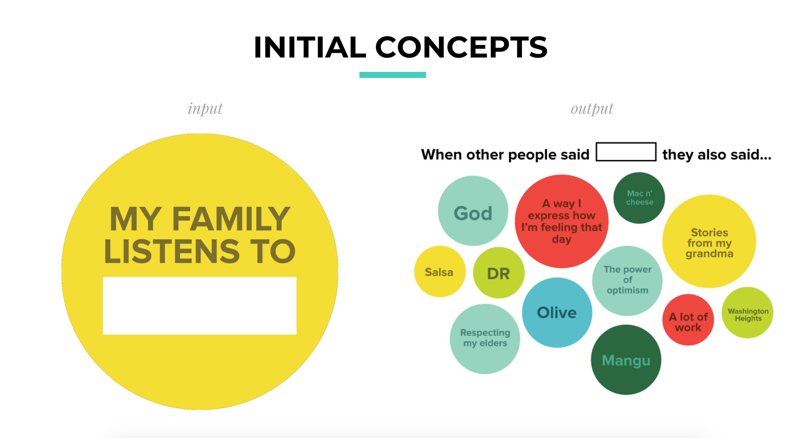
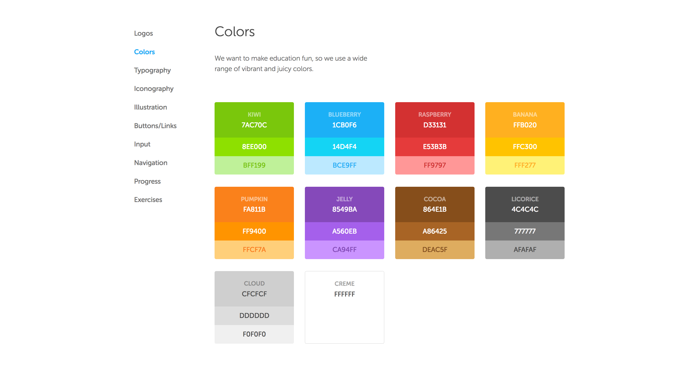

# WEEK `11`
## Final Project Proposals 

## ASSIGNMENT

* Now that we've reviewed your project proposals, you should begin making tangible steps forward toward building out the various components of your project. 

## AGENDA

### Final Project Proposals:

We will be reviewing your final project proposals as a group, providing feedback to your prepared presentations. 

You will have a strict 6 minutes to present and 3 minutes for questions & feedback. 

  * [] ...
  * [] ...
  * [] ...
  * [] ...
  * [] ...
  * [] ...

### Final Project Tips: Style Guide

> A styleguide is a set of standards, principles and rules every developer or designer should follow in order to improve the digital presence of the product. - [Andrei Dorin](https://medium.muz.li/how-to-create-a-style-guide-from-scratch-tips-and-tricks-e00f25b423bf)

Developing a [style guide](https://en.wikipedia.org/wiki/Style_guide) is an important skill for any project, whether it be a digital product or service or a data visualization or both. Style guides define all of the components of your project - the layout, typography (font sizes, font weights, styles), colors, forms (e.g. rounded edges for boxes, etc). By defining these features and planning a bit ahead of time, this can improve the look, feel, and consistency of the experience people have with your message and the project you're putting forth.

The following references explain what, why, and how you might start to make style guides for your projects.

**References**:

* General:
  * [Duo Lingo Style Guide](https://www.duolingo.com/design/)
    * Duo lingo, the language learning app, has an extensive style guide that shows how they defined the rules for their application
  * [Stylify](stylifyme.com/): 
    * A website that allows you to submit a URL to a website and get back a style guide for that webpage
    * Examples:
      * http://stylifyme.com/?stylify=https%3A%2F%2Felectronjs.org%2F
  * [Make a styleguide in sketch in 3 seconds](https://blog.prototypr.io/how-to-create-design-styleguide-in-sketch-for-3-seconds-23aabd6a5f85)
    * As the link title suggests, it is really simple to make a styleguide in sketch.
  * [Creating a style guide: let's start a sketch library](https://medium.com/sketch-app-sources/lets-start-a-sketch-library-12a7882faeb0)
* Data Vis specific:
  * [Urban Institute style guide for charts](http://urbaninstitute.github.io/graphics-styleguide/)
  * [IBM Design Language](https://www.ibm.com/design/language/experience/data-visualization/)
    * especially of interest might be [IBM's Chart Models](https://www.ibm.com/design/language/experience/data-visualization/chart-models/) - when to use which charts and why
    * [IBM Visualization guidelines](https://www.ibm.com/design/language/experience/data-visualization/visualization/)
  * [Duke's Data Viz Do's and Don'ts](https://guides.library.duke.edu/datavis/topten)

Additional interesting code/design references:

* [SuperHi!](https://twitter.com/superhi_): teaching designers how to code, the way designers do.

<!-- - Week 11: Synthesis I
  - Viz workflow:
    - wireframe
    - design
    - prototype
    - develop
    - iterate
    - collaborate
  - Alternative visualizations
    - "it doesn't always have to be on the web"
  -Assignment:
    - final project proposal -->

